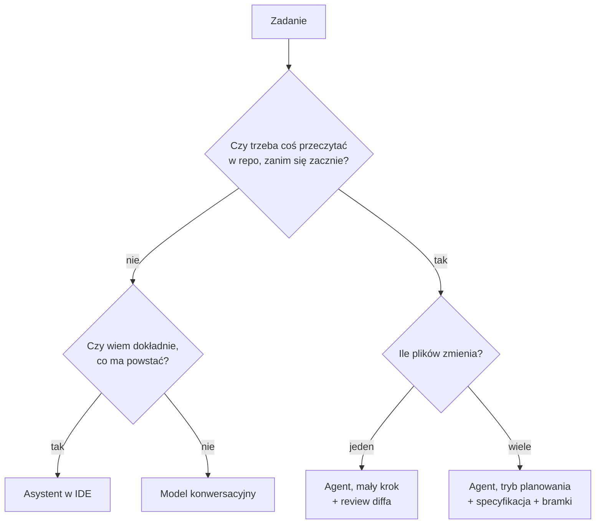

# Moduł 1 - Ekosystem i ograniczenia modeli

> Czego się tu nauczysz: dobierać klasę narzędzia i model do rodzaju zadania oraz rozpoznawać
> cztery tryby, w których model zawodzi - zanim zaufasz jego wynikowi.

---

## 1.1. Trzy klasy narzędzi, trzy różne kontrakty

Wszystkie trzy „rozmawiają z modelem", ale różnią się tym, **co widzą** i **co mogą zrobić**.
To nie jest różnica w wygodzie. To różnica w kontrakcie, który z nimi zawierasz.

| | Model konwersacyjny | Asystent w IDE | Agent w repozytorium |
|---|---|---|---|
| Przykłady | claude.ai, ChatGPT | Copilot inline, autouzupełnianie | Claude Code, Cursor Agent, Codex CLI |
| Co widzi | to, co wkleisz | otwarty plik + kilka sąsiednich | całe repo, ale czyta selektywnie |
| Co może zrobić | wypisać tekst | wstawić fragment kodu | czytać, pisać, uruchamiać komendy, commitować |
| Kto weryfikuje | ty, przed wklejeniem | ty, przy akceptacji podpowiedzi | **musisz to zorganizować** |
| Pętla zwrotna | brak | kompilator / linter w IDE | testy, hooki, CI - jeśli je masz |
| Koszt błędu | zero (nic się nie stało) | mały (widzisz diff od razu) | **duży** (zmiany w wielu plikach naraz) |

### Kiedy które

**Model konwersacyjny** - gdy problem nie jest w kodzie, tylko w twojej głowie.
Wybór biblioteki, ocena trzech podejść do migracji, sformułowanie wymagania, zrozumienie
nieznanego protokołu. Nie ma kontekstu projektu i to jest zaleta: nie zasugeruje się tym,
jak coś zrobiono u ciebie do tej pory.

**Asystent w IDE** - gdy wiesz dokładnie, co ma powstać, i chodzi tylko o szybkość pisania.
Kolejna funkcja według wzorca, który już jest obok. Test do funkcji, którą właśnie napisałeś.
Wypełnienie struktury, której kształt jest oczywisty.

**Agent w repozytorium** - gdy zadanie wymaga **przeczytania czegoś, zanim zacznie się pisać**.
Analiza, gdzie leży problem. Zmiana dotykająca kilku plików. Migracja. Napisanie testów
do kodu, którego nie znasz. Wszystko, co zaczyna się od „znajdź, a potem zmień".

Najczęstszy błąd na starcie: używanie agenta do zadań z gałęzi „nie" (płacisz za czytanie repo,
którego nie potrzebujesz) albo asystenta w IDE do zadań z gałęzi „wiele plików"
(dostajesz spójny lokalnie kod, który nie pasuje do reszty systemu).

---

## 1.2. Model-to-Task Mapping

Modele różnią się nie „jakością" w skali 1-10, tylko **stosunkiem zdolności do ceny**.
Dobranie modelu do zadania to najprostsza dźwignia kosztowa, jaką masz - i jedyna,
która nic nie kosztuje w implementacji.

Stan na wrzesień 2026 (ceny za milion tokenów, API Anthropic):

| Model | ID | Kontekst | Wejście | Wyjście |
|---|---|---|---|---|
| Claude Opus 5 | `claude-opus-5` | 1M | $5 | $25 |
| Claude Sonnet 5 | `claude-sonnet-5` | 1M | $2 | $10 |
| Claude Haiku 4.5 | `claude-haiku-4-5` | 200K | $1 | $5 |

> Ceny i dostępność modeli zmieniają się. Nie ucz się tej tabeli na pamięć - naucz się jej
> sprawdzać: `/model` w Claude Code pokazuje aktualną listę, a `client.models.list()` w API
> zwraca `max_input_tokens` i `capabilities` każdego modelu.

Mapowanie, które działa w praktyce:

| Rodzaj zadania | Model | Dlaczego |
|---|---|---|
| Decyzja architektoniczna, plan migracji, analiza ryzyk | Opus | Błąd na tym etapie kosztuje dni pracy. Różnica w cenie modelu jest przy tym niezauważalna |
| Implementacja wg gotowej specyfikacji | Sonnet | Kształt rozwiązania jest już ustalony, zostaje wykonanie |
| Masowe, mechaniczne przekształcenia (rename, migracja składni) | Haiku / Sonnet | Zadanie jest deterministyczne, liczy się przepustowość |
| Subagent zbierający fakty („znajdź wszystkie wywołania X") | Haiku | Wynik to lista, nie rozumowanie |
| Code review pod kątem bezpieczeństwa | Opus | Fałszywy negatyw jest droższy niż cały koszt modelu |
| Debugowanie, gdy nie wiesz, gdzie jest problem | Opus | Cała wartość leży w postawieniu dobrej hipotezy |

### Poziom wysiłku (effort) - druga dźwignia

Poza wyborem modelu sterujesz **głębokością rozumowania**: `/effort` w Claude Code,
`output_config.effort` w API. Pięć poziomów: `low`, `medium`, `high`, `xhigh`, `max`.

> **Nie każdy model obsługuje effort.** Działa na Opusie, Sonnecie 5 i Fable.
> **Haiku 4.5 go nie obsługuje** - ustawienie poziomu nic tam nie zmienia.
> Gdy ustawisz poziom, którego model nie ma, Claude Code schodzi do najwyższego
> obsługiwanego (`xhigh` na Opusie 4.6 działa jak `high`).
>
> Druga rzecz: `/effort` z **wpisanym** poziomem zapisuje go jako **domyślny
> na kolejne sesje**. To samo robi wybór modelu w `/model`. Łatwo o tym zapomnieć
> i przez tydzień płacić za Opusa na `max`.

Zasada: **najpierw zejdź z effortu, dopiero potem z modelu.** Nowszy model na niskim efforcie
często wypada lepiej niż starszy na wysokim - a przy tym nie rozbijasz cache'u
(cache jest przypisany do modelu, więc przeskakiwanie między modelami kosztuje osobno).

| Rodzaj pracy | Effort |
|---|---|
| Odpowiedź na pytanie o fakt z kodu | `low` |
| Rutynowa implementacja wg wzorca | `medium` |
| Domyślna praca nad kodem | `high` |
| Długie zadania agentowe, trudny debug | `xhigh` |
| Poprawność ważniejsza niż koszt (bezpieczeństwo, migracja danych) | `max` |

---

## 1.3. Cztery tryby, w których model zawodzi

To nie są „wady, które kiedyś naprawią". To właściwości działania modeli językowych.
Twoja praca polega na zbudowaniu procesu, który je łapie - nie na nadziei, że nie wystąpią.

### Halucynacja

Model generuje tekst, który brzmi jak odpowiedź, bo **statystycznie tak wygląda odpowiedź** -
a nie dlatego, że coś sprawdził.

Objawy w kodzie:
- funkcja, metoda albo pole, którego nie ma w projekcie,
- parametr biblioteki z sąsiedniej wersji,
- plik pod ścieżką, która „wyglądałaby sensownie",
- cytat z dokumentacji, którego w niej nie ma.

**Reguła przeciwdziałania:** jeżeli model twierdzi coś o twoim kodzie, ma to pokazać.
Nie „wyjaśnij mi, co robi `oblicz_odsetki`", tylko „przeczytaj plik, w którym jest
`oblicz_odsetki`, i zacytuj jego sygnaturę z numerem linii". Wymuszenie cytatu zamienia
halucynację w komunikat „nie znalazłem".

### Błędne założenie

Model dostaje niepełną specyfikację i **uzupełnia ją sam**, milcząco. Powstaje kod,
który działa i przechodzi testy - ale realizuje nie to wymaganie, które miałeś na myśli.

To jest groźniejsze od halucynacji, bo halucynacja się wywala, a błędne założenie przechodzi.
Cały moduł 3 jest o tym, jak pisać specyfikację odporną na dopowiadanie.

### Nadmierna pewność

Model nie ma wbudowanego sygnału „nie wiem". Odpowiedź zmyślona i odpowiedź sprawdzona
brzmią identycznie - tym samym rzeczowym tonem. Nie da się tego odróżnić po sposobie pisania.

**Reguła przeciwdziałania:** nie kalibruj zaufania po tonie. Kalibruj po tym, czy odpowiedź
jest **weryfikowalna**: czy ma cytat z pliku, czy testy przechodzą, czy komenda się wykonała.
Odpowiedź bez punktu zaczepienia w rzeczywistości traktuj jak hipotezę.

### Rozrost kontekstu

Im dłużej trwa sesja, tym więcej model niesie ze sobą: pliki przeczytane pół godziny temu,
wyniki komend, ślepe uliczki. Konsekwencje:

- **rośnie koszt** - cała historia jest wysyłana przy każdym zapytaniu,
- **spada jakość** - właściwa instrukcja tonie wśród nieistotnych szczegółów,
- **wracają porzucone pomysły** - model „pamięta" odrzucone podejście i do niego wraca.

**Reguła przeciwdziałania:** `/clear` między niepowiązanymi zadaniami. Jedna sesja = jedno
zadanie. Szczegóły w module 7.

---

## 1.4. Środowisko kursu: Claude Code

Cały kurs prowadzimy na Claude Code, bo ma komplet elementów, o których jest ten program:
pliki kontekstowe, tryb planowania, hooki, subagentów, worktree i widoczne liczniki zużycia.
Nie chodzi o narzędzie - chodzi o to, żeby dało się pokazać każdy mechanizm, o którym mówimy.

### Minimum, które musisz umieć od teraz

| Komenda | Do czego |
|---|---|
| `claude` | start sesji w bieżącym katalogu |
| `/model` | zmiana modelu, pokazuje aktualną listę i ceny |
| `/effort` | zmiana poziomu wysiłku |
| `/context` | co zajmuje okno kontekstowe |
| `/usage` | zużycie: limity planu, atrybucja, statystyki cache |
| `/clear` | koniec zadania, czyścimy kontekst |
| `/rewind` | cofnięcie rozmowy i kodu do wcześniejszego punktu |
| `/status` | wersja, model, załadowane pliki ustawień |
| Shift+Tab | przełączanie trybu uprawnień, w tym trybu planowania |
| Esc | przerwanie pracy modelu **natychmiast** |
| Esc Esc | wybór punktu, do którego cofnąć rozmowę |

`Esc` to najważniejszy klawisz w tej liście. Gdy widzisz, że model idzie w złą stronę,
koszt przerwania po trzech sekundach jest zerowy, a koszt czekania do końca - pełny.

### Porównanie z alternatywami

Nie po to, żeby uzasadniać wybór, tylko po to, żebyś wiedział, co przenieść do środowiska,
które masz w firmie.

| | Claude Code | Cursor | GitHub Copilot | Codex CLI | Gemini CLI |
|---|---|---|---|---|---|
| Forma | CLI + IDE + desktop | fork VS Code | rozszerzenie IDE + agent | CLI | CLI |
| Plik kontekstowy projektu | `CLAUDE.md` | `.cursor/rules/` | `.github/copilot-instructions.md` | `AGENTS.md` | `GEMINI.md` |
| Hooki na zdarzenia | tak, 33 zdarzenia, blokujące | ograniczone | nie | ograniczone | ograniczone |
| Subagenci z własnym kontekstem | tak | częściowo | nie | nie | nie |
| Izolacja w git worktree | wbudowana (`--worktree`) | ręcznie | nie dotyczy | ręcznie | ręcznie |
| Reużywalne workflow w repo | skille (`.claude/skills/`) | reguły | prompt files | nie | rozszerzenia |
| Rozliczenie | subskrypcja lub API | subskrypcja | subskrypcja | API | API / subskrypcja |

**Co przenosi się między narzędziami, a co nie**

Przenosi się **sposób pracy**: pisanie specyfikacji przed implementacją, małe kroki,
deterministyczne bramki, higiena kontekstu, review diffa przed commitem. To jest 80% tego kursu
i działa wszędzie.

Nie przenosi się **mechanika**: składnia hooków, format skilla, nazwa pliku kontekstowego.
To trzeba przetłumaczyć na narzędzie, które masz.

Gdy pracujesz w zespole mieszanym: pliki kontekstowe trzymajcie w repo w tylu wariantach,
ile narzędzi jest w użyciu, ale **treść niech będzie jedna** - jeden plik źródłowy, reszta
niech go dołącza albo niech będzie generowana. Dwie rozjeżdżające się wersje standardów
projektu są gorsze niż żadna.

---

## 1.5. Czego ten kurs nie obiecuje

Trzy rzeczy warto ustawić od razu, bo inaczej pojawiają się jako rozczarowanie w module 5.

**Agent nie zastąpi zrozumienia problemu.** Zamienia „napisz ten kod" na „sprawdź ten kod".
Druga czynność jest szybsza, ale wymaga tej samej wiedzy. Jeśli nie umiesz ocenić diffa,
agent nie przyspiesza cię - tylko przyspiesza wjazd długu technicznego.

**Prędkość generowania to nie prędkość dostarczania.** Wąskim gardłem przestaje być pisanie,
a staje się weryfikacja. Dlatego drugi dzień jest w całości o tym, jak zrobić weryfikację
deterministyczną, zamiast czytać wszystko oczami.

**Nie każde zadanie się opłaca.** Jednolinijkowa poprawka, którą znasz na pamięć, jest szybsza
z klawiatury. Sesja agenta ma stały narzut: wczytanie kontekstu, czytanie plików, diff, review.
Poniżej pewnego progu narzut jest większy niż zysk.

---

## Do zapamiętania

1. Trzy klasy narzędzi różnią się kontraktem, nie wygodą. Agent widzi repo i może w nim pisać -
   dlatego wymaga procesu, a nie tylko dobrego promptu.
2. Model dobieraj do kosztu błędu, nie do trudności zadania. Najpierw schodź z effortu, potem z modelu.
3. Cztery tryby porażki: halucynacja, błędne założenie, nadmierna pewność, rozrost kontekstu.
   Każdy ma swoją regułę przeciwdziałania - wymuszony cytat, precyzyjna specyfikacja,
   weryfikowalność, `/clear`.
4. Ton odpowiedzi nie niesie żadnej informacji o jej prawdziwości.
5. Sposób pracy przenosi się między narzędziami. Mechanika nie.

Następny krok: [lab 1.1](lab-1-1.md). · [Ściąga](sciaga.md)
