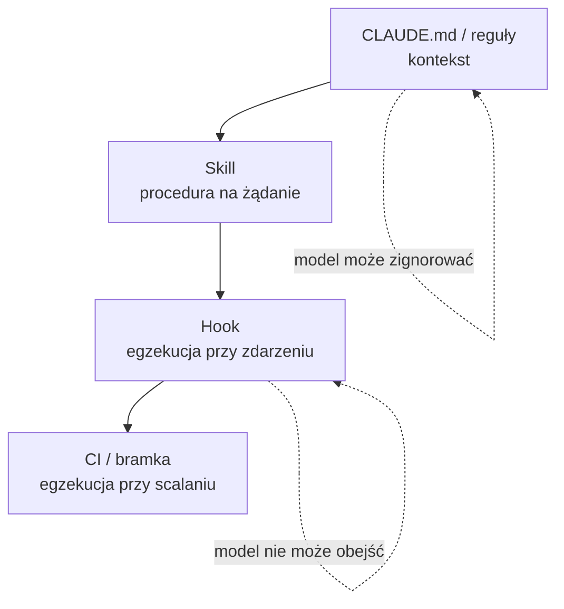

# Moduł 2 - Kontekst i dokumentacja LLM-ready

> Zakres modułu: świadome decydowanie, co model ma wiedzieć, a co go tylko zaśmieca -
> i zapisywanie standardów projektu tak, żeby faktycznie działały.

---

## Lekcja 2.1 - Okno kontekstowe to budżet, nie pojemnik

Model nie „pamięta" projektu. Przy każdym zapytaniu dostaje z powrotem **całą** treść
rozmowy: prompt systemowy, definicje narzędzi, pliki kontekstowe, wszystkie przeczytane pliki,
wyniki wszystkich komend i całą historię wymiany. To jest okno kontekstowe.

Dwie konsekwencje, które trzeba mieć w głowie jednocześnie:

**Suma przetworzonego kontekstu rośnie kwadratowo z liczbą tur.** Każde kolejne zapytanie
niesie wszystko, co było wcześniej, więc dziesiąte pytanie w sesji przetwarza znacznie
więcej niż pierwsze, nawet jeśli brzmi identycznie.

Rachunek nie rośnie tak samo szybko: prompt caching, kompakcja i sposób rozliczania
wyraźnie go spłaszczają. Kwadratowo rośnie **praca do wykonania**, a nie automatycznie
kwota - i to rozróżnienie jest tematem modułu 7.

**Jakość spada wraz z rozrostem.** To jest mniej oczywiste i ważniejsze. Model o oknie 1M tokenów
nie „rozumie" miliona tokenów równie dobrze jak dziesięciu tysięcy. Instrukcja utopiona wśród
czterdziestu przeczytanych plików działa słabiej niż ta sama instrukcja w czystej sesji.
Duże okno to nie zaproszenie do wrzucania wszystkiego - to bufor bezpieczeństwa.

### Co faktycznie siedzi w oknie

```
/context
```

Pokazuje rozbicie na kategorie. W świeżej sesji typowo:

| Kategoria | Co to jest |
|---|---|
| System prompt | stały prompt Claude Code |
| Tool definitions | opisy narzędzi, którymi model dysponuje |
| MCP tools | narzędzia z serwerów MCP |
| Memory files | `CLAUDE.md` i pokrewne - **tu widać, czy plik kontekstowy się załadował** |
| Messages | historia rozmowy |
| Free space | to, co zostało |

Kluczowa jest sekcja **Memory files**. To jedyne miejsce, w którym widać, czy napisany plik
kontekstowy faktycznie trafił do sesji. Jeśli go tam nie ma - model go nie widzi, kropka.

### Trzy odruchy higieny kontekstu

1. **`/clear` między niepowiązanymi zadaniami.** Jedna sesja = jedno zadanie. To jest
   najtańsza optymalizacja, jaka istnieje: kosztuje zero i działa natychmiast.
2. **Czytanie celowane zamiast hurtowego.** „Przeczytaj katalog `app/`" wciąga 1204 linie.
   „Znajdź, gdzie liczony jest rabat progowy" wciąga trzy funkcje. Ta sama odpowiedź,
   dwudziestokrotnie mniej kontekstu.
3. **Przerywanie.** `Esc`, gdy model wciąga niepotrzebne pliki. Nie da się
   wyjąć czegoś z kontekstu - da się tylko nie wpuścić.

---

## Lekcja 2.2 - RAG, long context, pliki projektowe - kiedy które

Trzy sposoby dostarczenia modelowi wiedzy. Nie konkurują ze sobą, rozwiązują różne problemy.

| | Pliki projektowe | Long context | RAG |
|---|---|---|---|
| Na czym polega | agent czyta repo narzędziami | całość trafia do promptu | wyszukiwarka podaje fragmenty |
| Kiedy | praca nad kodem, który jest w repo | jeden duży dokument, praca jednorazowa | duży, wolno zmienny zbiór wiedzy |
| Aktualność | zawsze bieżąca (czyta z dysku) | tyle, ile wklejono | tyle, ile ma indeks |
| Koszt | tylko przeczytane pliki | całość przy każdym zapytaniu | fragmenty + utrzymanie indeksu |
| Kiedy zawodzi | gdy wiedzy nie ma w repo | gdy „wszystko" nie mieści się w oknie | gdy pytanie nie trafia w indeks |

**Praktyczna reguła.** Wiedza o kodzie → pliki projektowe, zawsze. Agent ma `Grep` i `Read`
i sam dojdzie tam, gdzie trzeba. Przy repozytorium, które agent jest w stanie przeszukać
sam, RAG zwykle nie zarabia na siebie: kosztuje utrzymanie indeksu, a agent dostaje
nieaktualne fragmenty zamiast bieżącego pliku.

RAG ma sens dla wiedzy **spoza repo** i **dużej**: dokumentacja wewnętrzna na tysiąc stron,
archiwum zgłoszeń, regulacje branżowe. Progiem nie jest technologia, tylko pytanie:
*czy to da się przeczytać narzędziem plikowym?* Jeśli tak - wystarczy narzędzie plikowe.

Long context to przypadek graniczny: jednorazowa analiza jednego dużego dokumentu,
gdzie budowanie czegokolwiek byłoby stratą czasu.

---

## Lekcja 2.3 - Dokumentacja użyteczna dla ludzi i dla modeli

To ta sama dokumentacja. Model potrzebuje dokładnie tego, czego potrzebuje nowy
człowiek w zespole - tylko jest bardziej bezlitosny wobec braków, bo zwykle nie dopyta.
Zamiast tego dopowie.

### Co model wyciągnie sam z kodu (tego nie pisać)

- strukturę katalogów - `ls` mu wystarczy,
- listę zależności - `requirements.txt` jest w repo,
- sygnatury funkcji i typy - czyta je wprost,
- co robi funkcja - widzi jej treść.

Opis architektury, który wylicza katalogi i zależności, to najczęstszy typ dokumentacji
bezużytecznej dla modelu. Zajmuje kontekst i nie wnosi nic, czego model by nie zobaczył.

### Czego model **nie** wyciągnie (to pisać)

- **Dlaczego** tak jest, skoro dałoby się prościej.
- **Które zachowanie jest celowe**, mimo że wygląda na błąd.
- **Jaki jest zakres zmiany** - co wolno ruszać, czego nie wolno bez rozmowy.
- **Jakie są niewidoczne zależności** - że zmiana w tym module psuje raport w tamtym.
- **Jak się to uruchamia i weryfikuje** - komendy, nie opisy.
- **Co już próbowano i nie zadziałało.**

Przykład różnicy na kodzie z tego kursu:

> ❌ „Moduł `rabaty.py` liczy rabaty. Ma funkcje `stawka_progowa`, `stawka_rabatu`
> i `rabat_pozycji`."
>
> ✅ „`rabaty.py`: rabat progowy nie łączy się z ceną promocyjną - pozycja promocyjna wlicza się
> do progu rabatowego całej faktury, ale sama rabatu nie dostaje. To jest reguła biznesowa,
> nie błąd. Zmiana wymaga decyzji działu handlowego."

Pierwsze zdanie model przeczyta z kodu w sekundę. Drugiego nie przeczyta nigdy.

### Struktura, która się sprawdza

```
README.md                  # jak uruchomić, jak testować - dla człowieka i modelu
CLAUDE.md                  # zasady i pułapki projektu - dla modelu, czytelne dla człowieka
docs/architektura.md       # granice modułów, przepływy, decyzje
docs/domena.md             # słownik pojęć biznesowych i reguł
docs/adr/NNNN-*.md         # decyzje architektoniczne wraz z odrzuconymi alternatywami
```

`README.md` odpowiada na „jak to uruchomić". `docs/` odpowiada na „dlaczego tak".
`CLAUDE.md` odpowiada na „czego nie rób".

---

## Lekcja 2.4 - `CLAUDE.md` - mechanika

### Gdzie trafiają pliki i w jakiej kolejności

| Zakres | Ścieżka | Kto to widzi |
|---|---|---|
| Managed policy | macOS: `/Library/Application Support/ClaudeCode/CLAUDE.md`<br>Linux/WSL: `/etc/claude-code/CLAUDE.md`<br>Windows: `C:\Program Files\ClaudeCode\CLAUDE.md` | wszyscy w organizacji, **nie da się wyłączyć** |
| Użytkownik | `~/.claude/CLAUDE.md` | jeden użytkownik, we wszystkich projektach |
| Projekt | `./CLAUDE.md` albo `./.claude/CLAUDE.md` | zespół, przez repozytorium |
| Lokalny | `./CLAUDE.local.md` | jeden użytkownik, w tym projekcie (do `.gitignore`) |

Trzy rzeczy, które trzeba wiedzieć o ładowaniu:

1. **Pliki się sklejają, nie nadpisują.** Nie ma „przesłonięcia" reguły z wyższego poziomu.
   Jeśli `~/.claude/CLAUDE.md` mówi „zawsze po angielsku", a projektowy „zawsze po polsku",
   model dostaje obie sprzeczne instrukcje i wybiera w zasadzie losowo.
2. **Kolejność idzie od korzenia systemu plików w dół do katalogu uruchomienia sesji.**
   Instrukcje bliższe miejsca uruchomienia model czyta jako ostatnie.
3. **Pliki w podkatalogach ładują się dopiero wtedy, gdy model sięgnie po plik z tego katalogu.**
   To jest mechanizm oszczędzający kontekst w monorepo - i pułapka przy założeniu,
   że reguła zadziała od startu.

### Rozmiar

Cel: **poniżej 200 linii**. Nie dlatego, że tak ładniej - dłuższe pliki kosztują kontekst
w każdej sesji i **realnie obniżają przestrzeganie instrukcji**. Plik powyżej 4 MiB
jest pomijany w całości.

Przy rozroście pliku są trzy wyjścia, w tej kolejności:
- przenieść proceduralne workflow do **skilla** (ładuje się na wywołanie, nie zawsze),
- przenieść instrukcje dotyczące wycinka kodu do **reguły z `paths:`** (ładuje się przy dotknięciu
  pasującego pliku),
- dopiero na końcu rozbijać przez `@import` - bo **import ładuje się przy starcie tak samo**
  jak treść wklejona wprost. Import porządkuje pliki, nie oszczędza kontekstu.

### Import

```text
Przegląd projektu: @README.md
Zasady gita: @docs/git.md
```

Maksymalnie cztery poziomy zagnieżdżenia. Parser **pomija bloki i spany kodu** - ścieżka
zapisana bez importu wymaga backticków: `` `@README` ``.

Jeśli repo ma już `AGENTS.md` dla innego agenta, treści nie należy duplikować:

```markdown
@AGENTS.md

## Claude Code
Dla zmian w `app/rozliczenia.py` używaj trybu planowania.
```

### Reguły z zakresem ścieżek

```markdown
---
paths:
  - "app/**/*.py"
  - "tests/**/*.py"
---

# Zasady dla kodu Pythona
- Kwoty pieniężne tylko jako `Decimal`, nigdy `float`.
- Każda zmiana w `app/rozliczenia.py` wymaga testu charakterystyki.
```

Plik ląduje w `.claude/rules/`. Bez frontmattera `paths:` reguła ładuje się zawsze.
Z `paths:` - dopiero gdy model dotknie pasującego pliku. To jest najlepszy sposób
na trzymanie `CLAUDE.md` krótkim w dużym repozytorium.

### Komentarze dla ludzi

Komentarze HTML są **wycinane** przed wysłaniem do modelu:

```markdown
<!-- Utrzymuje zespół rozliczeń, pytania: #kanal-rozliczenia -->
```

Człowiek to widzi w repo, model nie płaci za to tokenami.

### Co **nie** ma prawa znaleźć się w `CLAUDE.md`

| Nie wpisuj | Dlaczego | Gdzie zamiast tego |
|---|---|---|
| Sekretów, tokenów, haseł | Plik jest w repo i w kontekście każdej sesji | zmienne środowiskowe, menedżer sekretów |
| Danych osobowych, treści klienta | To samo | nigdzie |
| Listy katalogów, listy zależności | Model to widzi sam | usunąć |
| Opisu, co robi każda funkcja | Model to czyta z kodu | usunąć |
| Reguł, które **muszą** zadziałać | `CLAUDE.md` to kontekst, nie wymuszenie | **hook** (moduł 5) |
| Długich procedur krok po kroku | Siedzą w kontekście, gdy są niepotrzebne | **skill** (moduł 5) |

Ostatnie dwa wiersze to najważniejsza rzecz w tym module; moduł 5 wraca do niej.

> `CLAUDE.md` trafia do modelu jako wiadomość użytkownika po prompcie systemowym.
> Model ją czyta i stara się stosować. **Nie jest to warstwa egzekucji.**
> Jeśli coś musi się wydarzyć zawsze - to jest zadanie dla hooka, nie dla instrukcji.

### Co przeżywa kompakcję

Gdy sesja się wydłuża, Claude Code streszcza starszą historię (`/compact` albo automatycznie).
Projektowy `CLAUDE.md` z korzenia jest po kompakcji **czytany ponownie z dysku** i wstrzykiwany
na nowo. Instrukcja podana tylko w rozmowie - przepada. Reguły z `paths:` i zagnieżdżone
`CLAUDE.md` wracają dopiero, gdy model znów dotknie pasującego pliku.

Praktyczny wniosek: wyjaśnienie, które w trakcie sesji trzeba było podać modelowi drugi raz,
jest kandydatem do `CLAUDE.md`, a nie do trzeciego wyjaśnienia.

---

## Lekcja 2.5 - Definiowanie standardów i ich egzekwowanie

Cztery warstwy, od najsłabszej do najmocniejszej. Nie są alternatywami - każda ma swoje miejsce.



| Warstwa | Siła | Kiedy |
|---|---|---|
| `CLAUDE.md`, reguły | model *stara się* stosować | konwencje, kontekst, pułapki |
| Skill | procedura, gdy zostanie wywołana | powtarzalne workflow zespołowe |
| Hook | **wykonuje się zawsze** przy zdarzeniu | format, blokady, bramki lokalne |
| CI | **blokuje scalenie** | ostateczna bramka dla całego zespołu |

Test, który rozstrzyga: **„co się stanie, jeśli model to zignoruje?"**
Jeśli odpowiedź brzmi „nic strasznego, poprawka na review" - `CLAUDE.md` wystarczy.
Jeśli brzmi „sekret trafi do repo" - to musi być hook albo CI.

### Jak pisać instrukcje, żeby działały

| Słabo | Dobrze |
|---|---|
| „Dbaj o jakość kodu" | „Przed commitem uruchom `make gate`" |
| „Testuj zmiany" | „Każda zmiana w `app/rozliczenia.py` wymaga testu w `tests/`" |
| „Nie psuj logiki biznesowej" | „Nie zmieniaj zachowania `oblicz_fakture()` bez testu charakterystyki" |
| „Formatuj kod" | „`ruff format`, długość linii 100" |

Reguła: instrukcja ma być **sprawdzalna**. Instrukcja, dla której nie da się napisać sposobu
sprawdzenia, jest nieegzekwowalna także dla modelu.

### Sprzeczności

Dwie sprzeczne reguły w plikach kontekstowych to gorszy stan niż brak reguły: model wybiera
jedną z nich w zasadzie arbitralnie i nie wiadomo którą. Przegląd standardów obejmuje szukanie
sprzeczności między `~/.claude/CLAUDE.md`, projektowym, zagnieżdżonymi i regułami.

---

## Lekcja 2.6 - MCP - jeszcze jeden kanał kontekstu

> **Rozszerzenie.** Ta część nie jest potrzebna do przejścia labów tego modułu.
> MCP nie ma w kursie ćwiczenia. Wraca natomiast w module 8 jako wektor ataku,
> więc warto przeczytać, nawet pomijając mechanikę podłączania serwerów.

Model Context Protocol to standard podłączania modelu do zewnętrznych źródeł: bazy, systemu
zgłoszeń, wyszukiwarki dokumentacji. Z punktu widzenia tego modułu MCP to **czwarty sposób
dostarczenia wiedzy** - obok plików projektowych, long contextu i RAG-a.

**Co warto wiedzieć teraz:**

- Definicje narzędzi MCP są domyślnie **odroczone** (mechanizm nazywa się *tool search*
  i jest włączony domyślnie): w kontekście siedzą nazwy narzędzi i instrukcje serwerów, a pełne
  schematy dociągają się przez narzędzie `ToolSearch`, gdy model faktycznie sięgnie po narzędzie.
  Sterowanie odbywa się przez `ENABLE_TOOL_SEARCH`: `false` wyłącza odroczenie,
  `auto` zostawia decyzję Claude Code. Własny `ANTHROPIC_BASE_URL` też je wyłącza.
  Mimo odroczenia `/context` pokazuje ich koszt - warto to sprawdzić.
- `/mcp` pokazuje podłączone serwery i pozwala wyłączyć nieużywane.
- Gdy istnieje **CLI** robiący to samo (`gh`, `aws`, `gcloud`), jest tańszy kontekstowo
  niż serwer MCP: nie dokłada żadnych definicji, model po prostu wywołuje komendę.

**Czego nie wolno zapomnieć:** serwer MCP to **zewnętrzne źródło tekstu, który trafia do modelu**.
Opis narzędzia, nazwa zasobu i zwrócone dane są dla modelu takimi samymi instrukcjami jak te
z plików kontekstowych. Niezaufany serwer może próbować sterować agentem. To jest wektor
prompt injection, do którego wraca moduł 8.

---

## Do zapamiętania

1. Okno kontekstowe to budżet. Rozrost kosztuje pieniądze **i** jakość.
2. `/context` → sekcja **Memory files** to jedyny dowód, że plik kontekstowy działa.
3. Wiedza o kodzie → pliki projektowe. RAG dopiero dla dużej wiedzy spoza repo.
4. Nie pisać tego, co model przeczyta z kodu. Pisać to, czego z kodu nie wyczyta:
   dlaczego, co celowe, czego nie ruszać.
5. `CLAUDE.md` poniżej 200 linii. Rośnie → skill albo reguła z `paths:`, nie `@import`.
6. `CLAUDE.md` to kontekst, nie egzekucja. Co musi zadziałać zawsze - idzie do hooka.
7. Sprzeczne reguły są gorsze niż brak reguł.

Następny krok: [lab 2.1](lab-2-1.md), potem [lab 2.2](lab-2-2.md). · [Ściąga](sciaga.md)
