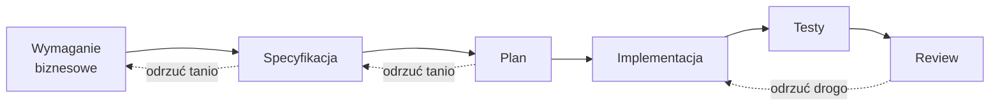

# Moduł 3 - Specification-Driven Development

> Czego się tu nauczysz: pisać specyfikację, której agent nie musi uzupełniać zgadywaniem,
> i prowadzić pracę tak, żeby każdy etap dało się odrzucić osobno.

---

## 3.1. Dlaczego agent wymaga precyzyjnej specyfikacji

Kiedy przekazujesz zadanie człowiekowi, zostawiasz luki celowo. „Dodaj noty odsetkowe
za przeterminowane faktury" wystarczy, bo kolega:

- zna kontekst biznesowy i wie, których klientów to dotyczy,
- **przyjdzie zapytać**, gdy coś będzie niejasne,
- zawaha się, jeśli poczuje, że robi coś ryzykownego,
- ma swoją opinię i powie ci, że pomysł jest zły.

Agent nie robi żadnej z tych czterech rzeczy. Dostaje lukę i **wypełnia ją najbardziej
prawdopodobną treścią** - czyli tym, co najczęściej występowało w kodzie, na którym się uczył.
Nie tym, co jest prawdą w twoim projekcie.

To nie jest wada do naprawienia lepszym modelem. To jest właściwość: model zawsze produkuje
najbardziej prawdopodobną kontynuację. Jeśli specyfikacja nie rozstrzyga, rozstrzygnie
statystyka.

### Jak wygląda dopowiedzenie

Prośba: *„Dodaj naliczanie odsetek za przeterminowane faktury."*

Czego agent nie wie, a i tak rozstrzygnie:

| Luka | Co najpewniej założy | Co może być prawdą u ciebie |
|---|---|---|
| Stopa odsetek | ustawowa, jedna, wpisana na sztywno | różna dla różnych umów, zmienna w czasie |
| Od kiedy liczyć | od dnia po terminie | od terminu, od doręczenia, od wezwania |
| Podstawa naliczania | kwota brutto | kwota netto albo kwota po odliczeniu wpłat |
| Rok bazowy | 365 dni | 365, 366 albo 360 zależnie od umowy |
| Zaokrąglanie | na końcu | po każdym dniu, do grosza, w dół |
| Faktury walutowe | tak samo jak złotówkowe | przewalutowanie po kursie z dnia zapłaty |
| Korekty | pominie temat | zmniejszają podstawę wstecz |
| Częściowe wpłaty | pominie temat | zmniejszają podstawę od dnia wpłaty |

Osiem rozstrzygnięć, o które nikt nie zapytał. Kod powstanie, testy (napisane do tego samego
założenia) przejdą, review nie zauważy - bo review sprawdza, czy kod robi to, co mówi,
a nie czy „to" jest właściwe.

**Błędne założenie jest groźniejsze od halucynacji.** Halucynacja się wywala. Założenie działa.

---

## 3.2. Tryb planowania

Tryb planowania rozdziela dwie czynności, które inaczej zlewają się w jedną: **ustalenie,
co zrobić** i **zrobienie tego**. W trybie planowania agent czyta pliki, uruchamia komendy
eksploracyjne i pisze plan - ale **nie edytuje kodu**. Edycje są zablokowane, dopóki
nie zatwierdzisz planu.

### Jak wejść i wyjść

| Sposób | Kiedy |
|---|---|
| `Shift+Tab` | przełączanie w trakcie sesji |
| `/plan` | włącza tryb planowania w bieżącej sesji; `/plan open` pokazuje aktualny plan |
| `claude --permission-mode plan` | cała sesja od startu |
| `"permissions": {"defaultMode": "plan"}` w `.claude/settings.json` | domyślnie dla całego projektu |

> **Uwaga na start:** na planach Pro, Max i Team sesja startuje domyślnie w trybie **auto**,
> w którym działania ocenia klasyfikator, a nie ty. `Shift+Tab` przechodzi przez kolejne tryby
> - **naciskaj, aż pasek statusu pokaże `⏸ plan mode on`.**
>
> Nie licz naciśnięć. Kolejność w cyklu zależy od wersji i od tego, które tryby opcjonalne
> są dostępne (`don't ask`, `bypass permissions` wchodzą po `plan`). Pasek statusu jest
> jedynym pewnym źródłem: `⏸ manual mode on` · `⏵⏵ accept edits on` · `⏸ plan mode on`
> · `⏵⏵ auto mode on`.

Wyjście bez zatwierdzania: `Shift+Tab` jeszcze raz.

### Zatwierdzanie planu

Gdy plan jest gotowy, dostajesz kilka opcji, zależnie od planu i konfiguracji:

- **Tak, w trybie auto** - agent zaczyna pracować, działania ocenia klasyfikator,
- **Tak, z auto-akceptacją edycji** - edycje plików idą bez pytania, reszta działań pyta,
- **Tak, zatwierdzam edycje ręcznie** - każda edycja wymaga twojej zgody,
- **Nie, planujemy dalej** - zostajesz w trybie planowania i mówisz, co poprawić.

`Ctrl+G` otwiera proponowany plan w edytorze, żebyś mógł go **poprawić ręcznie**
przed akceptacją. To jest niedoceniana opcja: szybciej jest skreślić trzy linie w edytorze
niż tłumaczyć agentowi, dlaczego są złe.

### Czego żądać od planu

Plan, który mówi tylko „zrobię X, potem Y, potem Z", nie wnosi nic - to jest lista rzeczy,
które i tak by się wydarzyły. Plan wart zatwierdzenia zawiera cztery elementy:

1. **Co zostało ustalone z kodu** - z plikami i numerami linii. To jest weryfikowalne.
2. **Jakie założenia zostały przyjęte** - wypisane wprost, każde osobno.
3. **Jakie są ryzyka** - co może się zepsuć poza obszarem zmiany.
4. **Jak zostanie zweryfikowane** - jakie testy, jakie przypadki brzegowe.

Punkt drugi jest najważniejszy. **Założenia wypisane to założenia, które możesz odrzucić.**
Założenia milczące trafiają prosto do kodu.

---

## 3.3. Jak pytać, żeby model nie dopowiadał

Cztery techniki, od najprostszej do najskuteczniejszej.

### 1. Każ wypisać pytania zamiast odpowiedzi

```
Zanim cokolwiek zaproponujesz: wypisz listę pytań, na które musisz znać odpowiedź,
żeby zaimplementować to poprawnie. Nie odpowiadaj na nie sam. Nie proponuj rozwiązania.
```

Najtańsza technika i zwykle najskuteczniejsza. Zamienia osiem milczących rozstrzygnięć
w osiem pytań na ekranie.

### 2. Każ oddzielić fakty od założeń

```
Podziel swoją odpowiedź na dwie sekcje:
USTALONE - co sprawdziłeś w kodzie, z plikiem i numerem linii.
ZAŁOŻONE - co przyjąłeś, bo nie było tego w kodzie ani w moim poleceniu.
Jeżeli sekcja ZAŁOŻONE jest pusta, to znaczy, że czegoś nie zauważyłeś.
```

Ostatnie zdanie jest istotne: bez niego model chętnie deklaruje, że niczego nie założył.

### 3. Podaj wprost zakres i granice

```
Zakres: tylko app/odsetki.py i testy do niego.
Nie zmieniaj: app/rozliczenia.py, app/vat.py, schematu bazy.
Jeżeli zadanie wymaga zmiany poza zakresem - zatrzymaj się i powiedz,
czego potrzebujesz. Nie rozszerzaj zakresu samodzielnie.
```

Agent domyślnie „naprawia po drodze". Bez granic dostajesz diff, w którym zmiana docelowa
tonie wśród pięciu poprawek, o które nikt nie prosił.

### 4. Podaj kryteria akceptacji jako przykłady liczbowe

```
Faktura 10 000 zł brutto, termin 2026-01-10, zapłacona 2026-02-10:
odsetki mają wynieść X zł.
Faktura zapłacona w terminie: 0 zł.
Faktura z korektą zmniejszającą: podstawa liczona od kwoty po korekcie.
```

Trzy liczby są warte więcej niż akapit prozy. Są jednoznaczne, weryfikowalne i zamieniają się
wprost w testy.

### Czego unikać

| Nie pisz | Bo | Napisz |
|---|---|---|
| „w razie potrzeby dodaj…" | model zawsze uzna, że potrzeba | wprost, czy ma dodać |
| „zrób to porządnie" | nieweryfikowalne | konkretne kryterium |
| „obsłuż przypadki brzegowe" | model wymyśli swoje | wymień, które |
| „jak w reszcie projektu" | w projekcie są trzy różne style | wskaż plik wzorcowy |
| „na razie uproszczona wersja" | nie wiadomo, co uproszczone | wypisz, czego **nie** robimy |

---

## 3.4. Workflow: wymaganie → specyfikacja → plan → implementacja → testy → review



Sens tego podziału jest jeden: **każdy etap można odrzucić osobno, a im wcześniej,
tym taniej.** Odrzucenie specyfikacji kosztuje pięć minut. Odrzucenie gotowej
implementacji kosztuje godzinę twojego czytania i całą pracę agenta.

| Etap | Produkt | Czego szukasz przy odbiorze |
|---|---|---|
| Wymaganie | zdanie po polsku, w języku biznesu | czy rozumiesz, po co to jest |
| Specyfikacja | plik `.md` w repo | czy nie ma dziur; czy założenia są wypisane |
| Plan | lista kroków + ryzyka | czy kolejność ma sens; czy da się przerwać w połowie |
| Implementacja | diff | czy mieści się w zakresie |
| Testy | testy, które **przeszły** | czy testują wymaganie, czy implementację |
| Review | decyzja | czy rozumiesz każdą linię, którą zatwierdzasz |

### Specyfikacja zostaje w repo

To nie jest formalność. Specyfikacja w `specyfikacje/*.md`:

- jest **kontekstem** dla agenta przy następnej zmianie w tym obszarze,
- jest **dokumentacją decyzji** - mówi, czego celowo nie zrobiliśmy,
- przechodzi przez **code review** jak kod,
- daje się **zdiffować**, gdy wymaganie się zmieni.

To jest ten sam mechanizm, który w module 5 zamieni workflow w skill: **artefakt w repo bije
wiedzę w głowie.**

### Pułapka: testy pisane pod implementację

Najczęstszy sposób, w jaki ten workflow po cichu przestaje działać: agent pisze kod,
potem pisze testy **patrząc na ten kod**. Testy przechodzą zawsze, bo sprawdzają,
czy kod robi to, co robi.

Przeciwdziałanie: **kryteria akceptacji powstają w specyfikacji, przed implementacją**,
i są liczbami. Wtedy test sprawdza wymaganie, a nie kod.

---

## 3.5. Przekładanie wymagania biznesowego na zadania

Wymaganie biznesowe brzmi: *„Chcemy naliczać odsetki za przeterminowane faktury,
bo klienci płacą po terminie."*

To zdanie zawiera **cel** (skłonić do płacenia w terminie), ale nie zawiera ani jednej
decyzji technicznej. Przełożenie polega na wydobyciu decyzji, a nie na zgadnięciu ich.

Trzy pytania, które trzeba zadać **człowiekowi**, nie modelowi:

1. **Kto jest odbiorcą wyniku?** Księgowość, która to zaksięguje? Handlowiec, który zadzwoni?
   Automat wysyłający wezwania? Od tego zależy, czy potrzebna jest kwota, czy pismo.
2. **Co się dzieje, gdy wynik jest zły?** Zaniżone odsetki to strata. Zawyżone to spór
   z klientem i ryzyko prawne. Asymetria kosztu błędu decyduje o tym, ile wysiłku
   wkładasz w przypadki brzegowe.
3. **Czego świadomie nie robimy w tej iteracji?** To jest pytanie, które ratuje najwięcej czasu.

Dopiero mając odpowiedzi, siadasz do agenta.

> **Zasada:** agent jest narzędziem do **zapisania** decyzji, nie do ich **podjęcia**.
> Jeśli nie umiesz odpowiedzieć na pytanie, na które odpowiada twój kod,
> to model też nie umie - po prostu nie powie ci tego.

---

## Do zapamiętania

1. Agent nie dopyta. Lukę w specyfikacji wypełni najbardziej prawdopodobną treścią.
2. Błędne założenie jest groźniejsze od halucynacji, bo przechodzi przez testy i review.
3. Tryb planowania rozdziela „co zrobić" od „zrobić". Plan bez wypisanych założeń i ryzyk
   nie jest planem.
4. Cztery techniki przeciw dopowiadaniu: wypisz pytania, oddziel ustalone od założonego,
   podaj granice zakresu, podaj kryteria jako liczby.
5. Specyfikacja jest artefaktem w repo: kontekstem dla agenta, dokumentacją decyzji
   i przedmiotem review.
6. Kryteria akceptacji powstają **przed** implementacją. Inaczej testy sprawdzają kod,
   a nie wymaganie.

Następny krok: [lab 3.1](lab-3-1.md), potem [lab 3.2](lab-3-2.md). · [Ściąga](sciaga.md)
