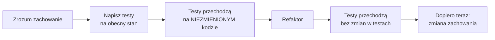

# Moduł 4 - AI w istniejącym kodzie

> Zakres modułu: wyciąganie z legacy tego, czego nikt nie zapisał, odróżnianie reguły
> biznesowej od błędu - i niedopuszczenie do „uproszczenia" przez agenta ani jednego,
> ani drugiego.

---

## Lekcja 4.1 - Dlaczego legacy jest trudniejsze niż nowy kod

Przy nowym kodzie agent ma jedno ograniczenie: specyfikację. W istniejącym kodzie
ma drugie, znacznie twardsze: **wszystko, co już działa i na czym ktoś polega.**

Trzy rzeczy, które robią różnicę:

**Kod niesie decyzje, których nie widać.** Dziwny warunek w środku funkcji to albo pomyłka
sprzed trzech lat, albo wynik spotkania z działem prawnym. Z samego kodu nie da się tego
rozstrzygnąć.

**Nie ma sieci bezpieczeństwa.** Nowy kod powstaje razem z testami. Legacy zwykle nie ma testów
dokładnie w tych miejscach, gdzie są najważniejsze - bo gdyby ktoś je napisał,
musiałby najpierw zrozumieć logikę.

**Agent jest wytrenowany na tym, jak kod wygląda „ładnie".** Zobaczy zagnieżdżonego ifa i zechce
go spłaszczyć. Zobaczy dwa zaokrąglenia i zechce zostawić jedno. Każda z tych zmian
jest sensowna w oderwaniu i każda może kosztować pieniądze.

> **Zasada modułu:** w legacy domyślną odpowiedzią na „czy to można uprościć?"
> jest „nie wiem, dopóki nie mam testu, który to utrwala".

---

## Lekcja 4.2 - Rozpoznawanie: wzorce, antywzorce, code smells

Agent dobrze znajduje rzeczy **mierzalne**. Warto go do tego użyć i nie oczekiwać więcej.

| Dobrze znajduje | Słabo ocenia |
|---|---|
| długie funkcje, głębokie zagnieżdżenia | czy długość jest uzasadniona |
| duplikację kodu | czy to duplikacja, czy przypadkowe podobieństwo |
| przestarzałe API (`datetime.utcnow()`) | które wywołanie jest krytyczne |
| sklejanie SQL-a ze stringów | czy dane wejściowe są już zwalidowane |
| martwy kod | czy naprawdę martwy, czy wołany dynamicznie |
| brakującą obsługę błędów | czy brak jest celowy |

Praktyczny wniosek: **inwentaryzacja dla agenta, ocena po stronie człowieka.**

```
Zrób inwentaryzację problemów w app/. Dla każdego podaj: plik, linię, rodzaj problemu
i jednozdaniowy opis. Nie proponuj poprawek. Nie oceniaj ważności.
Posortuj po pliku.
```

Lista faktów jest użyteczna. Rekomendacje od agenta, który nie zna domeny biznesowej,
nie są - bo ocena ryzyka wymaga wiedzy, której w kodzie nie ma.

### Uszeregowanie ryzyka - po stronie człowieka

Trzy pytania na każdy znaleziony problem:

1. **Co się stanie bez zmiany?** (nic / rośnie dług / awaria / strata pieniędzy)
2. **Co się stanie przy zmianie z pomyłką?** (nic / test złapie / produkcja)
3. **Czym sprawdzić, że nic się nie zepsuło?** (testy / ręcznie / nijak)

Problem z odpowiedzią „nijak" na trzecie pytanie **nie nadaje się do naprawy** - nadaje się
do napisania testu. To jest cała kolejność pracy w legacy.

---

## Lekcja 4.3 - Odtwarzanie intencji ze starego kodu

Najważniejsza umiejętność tego modułu. Chodzi o odpowiedź na pytanie
**„co ten kod miał robić"**, gdy dostępne jest tylko „co robi".

### Technika: opis zachowania zamiast opisu kodu

Pytanie „co robi ta funkcja" zwraca przepisany kod prozą, bezużyteczny.
Pytać należy o **zachowanie obserwowalne z zewnątrz**:

```
Przeczytaj oblicz_fakture() w app/rozliczenia.py. Opisz jej zachowanie jako listę
reguł w formie: "JEŻELI <warunek wejściowy> TO <obserwowalny skutek na wyniku>".
Nie opisuj struktury kodu. Nie używaj nazw zmiennych lokalnych.
Przy każdej regule podaj numer linii, z której ją odczytałeś.
```

Różnica jest zasadnicza. „Funkcja iteruje po pozycjach i sumuje wartości" to opis kodu.
„JEŻELI pozycja ma cenę promocyjną, TO nie dostaje rabatu progowego, ale jej wartość
i tak wlicza się do progu całej faktury" to reguła - da się ją potwierdzić u biznesu
i da się ją zamienić w test.

### Technika: pytanie o zaskoczenia

```
Które zachowania tej funkcji zaskoczyłyby programistę, który zna domenę fakturowania,
ale nie zna tego kodu? Wypisz je z numerami linii, od najbardziej zaskakującego.
```

To wydobywa dokładnie te miejsca, w których siedzi nieudokumentowana decyzja.
Kod nudny nikogo nie zaskakuje.

### Technika: hipoteza i test, nie wyrok

```
Dla każdej reguły powiedz, czy to wygląda na (a) celową regułę biznesową,
(b) błąd, (c) nie da się rozstrzygnąć z kodu.
Uzasadnij każdą klasyfikację. Jeżeli zaznaczasz (a) albo (b) - powiedz,
jaki dowód w repozytorium to potwierdza.
```

Ostatnie zdanie jest kluczowe. Bez niego odpowiedź brzmi stanowczo „to jest celowa reguła",
bez cienia dowodu - tak jak w labie 2.1.

**Odpowiedź (c) jest wartościowa.** Lista rzeczy, o które trzeba zapytać człowieka,
jest realnym produktem pracy z legacy.

---

## Lekcja 4.4 - Reguła czy błąd - rozróżnienie, na którym wszystko stoi

To jest istota modułu. Ten sam kawałek kodu może być jednym albo drugim,
a konsekwencje pomyłki są odwrotne.

|  | Reguła biznesowa | Błąd |
|---|---|---|
| Kod robi | to, co ktoś zdecydował | to, czego nikt nie chciał |
| „Uproszczenie" | **strata pieniędzy albo zgodności** | poprawa |
| Test charakterystyki | utrwala **na stałe** | utrwala **tymczasowo**, z komentarzem |
| Zmiana wymaga | decyzji biznesu | poprawki |
| Kto rozstrzyga | człowiek znający domenę | programista |

**Czego nie wolno robić:** rozstrzygać tego na podstawie tego, jak kod wygląda.
Reguła biznesowa w legacy wygląda dokładnie jak błąd - to jest jej cecha definicyjna,
bo gdyby wyglądała sensownie, nie byłoby problemu.

**Co robić:** utrwalić **oba** przypadki testem charakterystyki, opisać różnicę w komentarzu,
zapytać człowieka o te, których nie da się rozstrzygnąć. Test utrwalający błąd jest
niewygodny - i to dobrze, bo wtedy ktoś go w końcu zakwestionuje świadomie,
zamiast „poprawić" przy okazji.

> Test charakterystyki nie mówi „tak ma być".
> Mówi „tak jest w tej wersji, a zmiana wymaga świadomej decyzji".

---

## Lekcja 4.5 - Testy zabezpieczające (characterization tests)

Test charakterystyki to test, który **utrwala obecne zachowanie** - niezależnie od tego,
czy jest poprawne. Powstaje po to, żeby refaktoryzacja niczego nie zmieniła.

### Kolejność, od której nie ma odstępstw



Krok C jest tym, który wszyscy pomijają. **Test charakterystyki musi przejść na kodzie
jeszcze niezmienionym.** Jeśli od razu nie przechodzi, to nie jest test
charakterystyki - to jest test wyobrażenia o tym kodzie.

### Jak to zlecić agentowi

```
Napisz testy charakterystyki dla oblicz_fakture() w app/rozliczenia.py.

Zasady:
- Testy mają utrwalać zachowanie, które funkcja ma TERAZ - nie to, które uważasz
  za poprawne.
- Jeżeli jakaś wartość wygląda na błędną, ZAPISZ JĄ TAKĄ, JAKA JEST,
  i dodaj komentarz "# wyglada na blad, do potwierdzenia u biznesu".
- Nie zmieniaj ani jednej linii w app/.
- Wartości oczekiwane wylicz, uruchamiając funkcję, nie z własnych obliczeń.
- Pokryj: fakturę bez rabatu, z rabatem progowym, z pozycją promocyjną,
  z promocją wygasłą, z zaliczką, korektę, walutową, z wieloma stawkami VAT.
```

Trzy zdania robią tu całą robotę:

- **„zachowanie, które funkcja ma TERAZ"** - blokuje poprawianie przy okazji,
- **„zapisz taką, jaka jest, i dodaj komentarz"** - daje ujście podejrzeniom,
  nie wpuszczając ich do kodu,
- **„wylicz, uruchamiając funkcję"** - chroni przed testem napisanym pod wyobrażenie.

### Jak poznać, że test charakterystyki jest dobry

- Przechodzi **przed** refaktoryzacją.
- Nie odwołuje się do prywatnych funkcji ani zmiennych lokalnych - tylko do wejścia i wyjścia.
- Liczby są **konkretne**, nie przeliczane w teście tą samą formułą co w kodzie.
- Nazwa mówi, jaki przypadek utrwala, a nie „test_1".

### Antywzorzec: test, który liczy to samo co kod

```python
# ŹLE - test przejdzie zawsze, także po zepsuciu kodu
assert wynik.vat == wynik.netto * Decimal("0.23")

# DOBRZE - liczba utrwalona
assert wynik.vat == Decimal("119.60")
```

Pierwszy wariant powtarza logikę produkcyjną w teście. Jeżeli w kodzie jest błąd
w zaokrąglaniu, test go powtórzy i będzie zielony.

---

## Lekcja 4.6 - Jak nie dopuścić do „uproszczenia"

Cztery poziomy obrony, od najsłabszego do najmocniejszego.

**1. Polecenie wprost w prompcie.**

```
Nie zmieniaj żadnego zachowania. Jeżeli uważasz, że coś jest błędem,
NAPISZ MI O TYM, ale nie poprawiaj. To jest refaktoryzacja czysto strukturalna:
te same wejścia mają dawać te same wyjścia co do grosza.
```

**2. Zapis w `CLAUDE.md`.** Ostrzeżenie o funkcji, której nie wolno upraszczać,
działa w każdej sesji, także wtedy, gdy zabraknie go w prompcie.

**3. Testy charakterystyki.** Tu obrona przestaje zależeć od tego, czy model posłuchał.
„Uproszczenie" zmieniające wynik **nie przechodzi testu**.

**4. Hook, który uruchamia testy.** Moduł 5. Model nie zakończy pracy **po cichu**
przy czerwonej bramce - hook wymusza próbę naprawy i jawne ostrzeżenie.

Progresja jest tu istotna: pierwsze dwa poziomy to **prośby**, poziom trzeci to **fakt**
(test albo przechodzi, albo nie), a czwarty to **wymuszenie**, nie blokada absolutna.
Hook blokuje pierwszą próbę zakończenia; po niej przepuszcza turę z ostrzeżeniem, żeby
sesja nie kręciła się w kółko. Czerwony kod przed wejściem do gałęzi głównej zatrzymuje
dopiero wymagany check w ustawieniach repozytorium.

### Sygnały ostrzegawcze w wypowiedzi agenta

Zdania, po których trzeba zajrzeć w diff:

> „Uprościłem też…" · „Przy okazji poprawiłem…" · „Ten warunek wydawał się zbędny…"
> · „Ujednoliciłem zaokrąglanie…" · „To wyglądało na pomyłkę, więc…"

Każde z nich oznacza zmianę zachowania zgłoszoną jako porządki.

---

## Lekcja 4.7 - Planowanie migracji

Migracja biblioteki, frameworka albo standardu języka to zadanie, w którym agent jest
wyjątkowo przydatny - **pod warunkiem że nie planuje jej sam**.

### Co zlecić agentowi

| Do zlecenia | Nie do zlecenia |
|---|---|
| inwentaryzację wystąpień (gdzie, ile, w jakim kontekście) | decyzji, czy migrować |
| klasyfikację: mechaniczne vs. wymagające decyzji | wyboru wersji docelowej |
| wykonanie zmian mechanicznych, partiami | wykonania wszystkiego naraz |
| listę miejsc, gdzie zmiana semantyki jest realna | oceny ryzyka biznesowego |

### Wzorzec migracji, który działa

1. **Inwentaryzacja.** Ile wystąpień, w ilu plikach, w jakich kontekstach.
2. **Podział na mechaniczne i nietrywialne.** Zamiana `datetime.utcnow()` na
   `datetime.now(UTC)` jest mechaniczna - ale **nie jest równoważna**: nowa wersja
   zwraca obiekt świadomy strefy. Każde miejsce, w którym wynik jest porównywany
   albo zapisywany, wymaga decyzji.
3. **Testy przed migracją**, na obecne zachowanie.
4. **Partiami**, z osobnym commitem na partię. Migracja w jednym commicie
   na 40 plików jest nierecenzowalna.
5. **Weryfikacja**, że zachowanie się nie zmieniło.

Punkt 2 jest tym, który zawsze się mści. „Mechaniczna zamiana" prawie nigdy nie jest
w pełni mechaniczna - zmienia się typ, strefa, precyzja albo zachowanie przy błędzie.

---

## Do zapamiętania

1. W legacy domyślna odpowiedź na „czy to można uprościć?" brzmi „nie wiem,
   dopóki nie mam testu".
2. Agent dobrze **inwentaryzuje**, słabo **ocenia ważność**. Te dwie czynności trzeba rozdzielić.
3. Pytać o zachowanie („JEŻELI… TO…"), nie o kod. Pytać o zaskoczenia.
4. Reguła biznesowa w legacy wygląda dokładnie jak błąd. Wygląd nie rozstrzyga.
5. Test charakterystyki musi przejść **przed** refaktoryzacją. Inaczej to nie jest
   test charakterystyki.
6. Test, który liczy to samo, co kod, jest zawsze zielony i nic nie chroni.
7. Cztery poziomy obrony przed „uproszczeniem": prompt, `CLAUDE.md`, testy, hook.
   Dwa pierwsze to prośby, dwa ostatnie to fakty.
8. „Mechaniczna" migracja prawie nigdy nie jest w pełni mechaniczna.

Następny krok: [lab 4.1](lab-4-1.md), [lab 4.2](lab-4-2.md), [lab 4.3](lab-4-3.md). · [Ściąga](sciaga.md)
