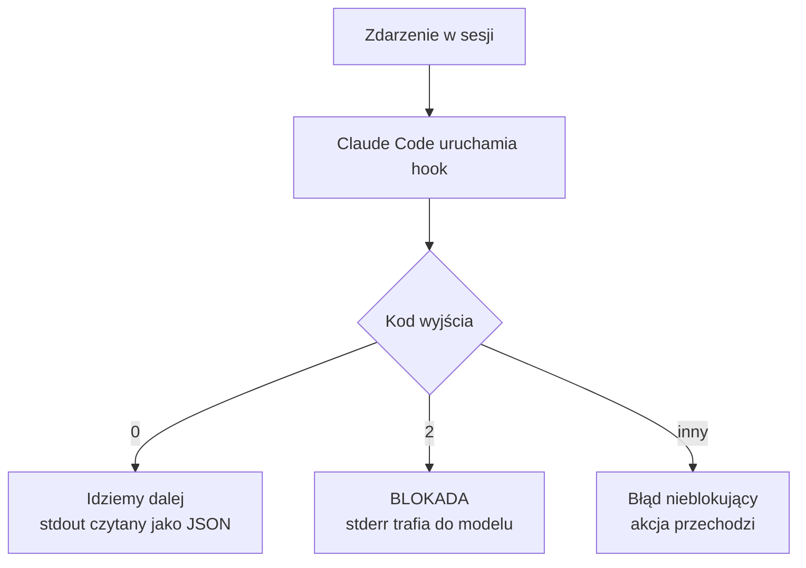
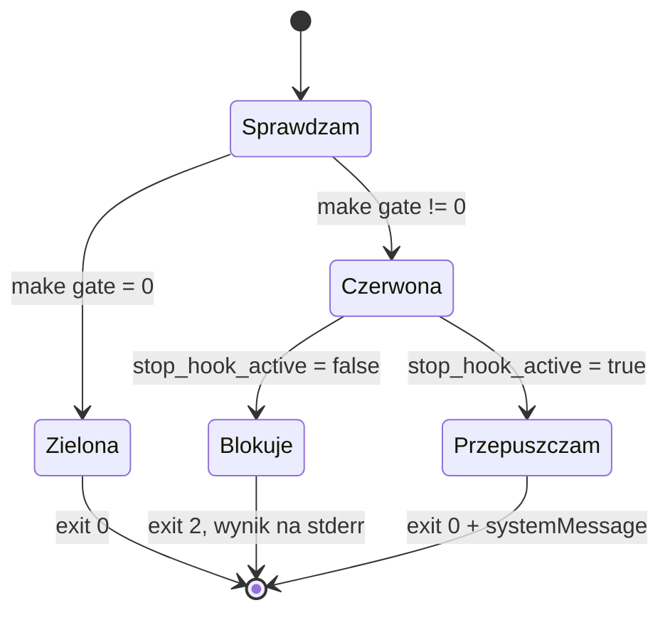

# Moduł 5 - Praca z agentem i deterministyczne bramki

> Czego się tu nauczysz: prowadzić agenta małymi krokami, które da się cofnąć,
> i zamienić prośby z `CLAUDE.md` na mechanizmy, których model nie może zignorować.

---

## 5.1. Małe kroki i kontrola zmian

### Dlaczego mały krok

Wąskim gardłem pracy z agentem nie jest generowanie kodu, tylko **weryfikacja**.
Koszt weryfikacji rośnie szybciej niż liniowo z wielkością diffa: przy 40 zmienionych liniach
czytasz je; przy 400 przeglądasz; przy 4000 akceptujesz i masz nadzieję.

| Krok | Diff | Weryfikacja | Koszt pomyłki |
|---|---|---|---|
| jedna funkcja + test | ~50 linii | czytasz całość | minuty |
| jeden moduł | ~300 linii | czytasz wyrywkowo | godzina |
| „zrób tę funkcjonalność" | 1500+ linii | nie weryfikujesz | dni, często na produkcji |

Reguła praktyczna: **krok kończy się w momencie, w którym repo jest w stanie nadającym się
do commita.** Jeśli nie umiesz napisać sensownego komunikatu commita, krok był za duży
albo obejmował dwie różne rzeczy.

### Cztery narzędzia kontroli

| Narzędzie | Kiedy | Co daje |
|---|---|---|
| `git diff` | po każdym kroku | jedyny wiarygodny opis tego, co się stało |
| `git commit` | na końcu kroku | punkt, do którego można wrócić |
| review | przed commitem | twoja odpowiedzialność, nie agenta |
| `/rewind`, `Esc Esc` | gdy poszło źle | cofnięcie rozmowy **i** kodu |

**`git diff` bije opis agenta.** Podsumowanie „dodałem funkcję i testy" bywa prawdziwe
i niekompletne jednocześnie. Diff nie ma takiej możliwości.

### Cofanie

| Sytuacja | Narzędzie |
|---|---|
| Model idzie w złą stronę, właśnie to widzisz | `Esc` |
| Chcesz wrócić do wcześniejszego punktu rozmowy i kodu | `Esc Esc` albo `/rewind` |
| Zmiany są w plikach, nie w commicie | `git checkout -- <plik>` |
| Zmiany są w ostatnim commicie | `git reset --soft HEAD~1` |
| Nie wiesz, co się stało | `git stash` i spokojnie obejrzyj |

`/rewind` cofa **rozmowę i kod jednocześnie** - to jest różnica wobec samego `git checkout`,
po którym model nadal „pamięta", że napisał coś, czego już nie ma.

---

## 5.2. Hooki - egzekucja zamiast prośby

`CLAUDE.md` mówi modelowi, co ma robić. Hook **wykonuje kod** przy zdarzeniu,
niezależnie od tego, co model uważa.



### Zdarzenia

Claude Code ma ich ponad trzydzieści. W praktyce codziennej wystarczą cztery:

| Zdarzenie | Kiedy | Typowe zastosowanie |
|---|---|---|
| `SessionStart` | start, wznowienie, `/clear`, kompakcja | wstrzyknięcie kontekstu (stdout **trafia do modelu**) |
| `PreToolUse` | **przed** wywołaniem narzędzia | blokada niebezpiecznych komend, podmiana wejścia |
| `PostToolUse` | **po** wywołaniu narzędzia | auto-format, walidacja tego, co powstało |
| `Stop` | model chce zakończyć turę | bramka jakości: testy, lint |

Pozostałe, które warto znać z nazwy: `UserPromptSubmit` (można zablokować prompt),
`SubagentStop`, `PreCompact`, `SessionEnd`, `WorktreeCreate`/`WorktreeRemove`,
`FileChanged`, `PermissionRequest`.

### Konfiguracja

```json
{
  "hooks": {
    "PreToolUse": [
      {
        "matcher": "Bash",
        "hooks": [
          {
            "type": "command",
            "command": "${CLAUDE_PROJECT_DIR}/.claude/hooks/blokuj-niebezpieczne.sh",
            "statusMessage": "sprawdzam komende"
          }
        ]
      }
    ]
  }
}
```

**Matcher** ma trzy tryby, zależnie od znaków, które w nim są:

| Wartość | Jak działa |
|---|---|
| `"*"`, `""` albo brak | wszystko |
| tylko litery, cyfry, `_`, `-`, spacje, `,`, `\|` | dokładny string albo lista: `Edit\|Write` |
| cokolwiek innego | **regex JavaScript**, niezakotwiczony: `^Notebook`, `mcp__.*` |

Dla zdarzeń nie-narzędziowych matcher ma własne słowniki: `SessionStart` przyjmuje
`startup`, `resume`, `clear`, `compact`, `fork`; `PreCompact` - `manual`, `auto`.
Część zdarzeń nie obsługuje matchera w ogóle: `UserPromptSubmit`, `Stop`, `PostToolBatch`.

Poza `command` istnieją typy `http`, `mcp_tool`, `prompt` i `agent` - ostatnie dwa wołają model.
Na start wystarczy `command`.

### Kody wyjścia - to jest cała mechanika

| Kod | Znaczenie |
|---|---|
| **0** | sukces; stdout parsowany jako JSON, jeśli zaczyna się `{` i kończy `}` |
| **2** | **blokada**; komunikat z pola `reason` albo ze stderr |
| inny | błąd nieblokujący: akcja przechodzi, w transkrypcie pojawia się notka o błędzie |

**Co blokuje przy kodzie 2** (m.in.): `PreToolUse` (blokuje narzędzie), `UserPromptSubmit`
(kasuje prompt), `UserPromptExpansion`, `Stop` i `SubagentStop` (**nie pozwalają zakończyć
tury**), `PostToolBatch`, `PreCompact`, `TaskCreated`, `TaskCompleted`, `ConfigChange`,
`PreModelSwitch`, `WorktreeCreate`/`WorktreeRemove`.

**Co nie blokuje - ale to nie znaczy, że nic nie robi.** Trzy różne zachowania,
łatwe do pomylenia:

| Zdarzenie | Co robi kod 2 |
|---|---|
| `PostToolUse`, `PostToolUseFailure` | **pokazuje stderr modelowi** - narzędzie już się wykonało, ale ostrzeżenie dociera |
| `SessionStart`, `SessionEnd`, `FileChanged`, `CwdChanged` | pokazuje stderr **tylko użytkownikowi** |
| `PermissionRequest`, `PermissionDenied`, `Notification`, `Setup` | ignoruje całkowicie |

Pierwszy wiersz jest użyteczny: to **jedyny** sposób, żeby hook `PostToolUse` powiedział coś
modelowi. Przy kodzie 0 stderr idzie wyłącznie do logu debugowania i model go nie widzi.

**stdout trafia do modelu tylko przy czterech zdarzeniach:** `SessionStart`,
`UserPromptSubmit`, `UserPromptExpansion`, `PostModelSwitch`. Przy pozostałych idzie
do logu debugowania - jeśli chcesz coś powiedzieć modelowi, użyj JSON-a z polem
`systemMessage` albo stderr przy blokadzie.

### Wejście na stdin

```json
{
  "session_id": "abc123",
  "cwd": "/home/user/projekt",
  "scratchpad_dir": "/tmp/claude-1000/.../scratchpad",
  "permission_mode": "default",
  "hook_event_name": "PreToolUse",
  "tool_name": "Bash",
  "tool_input": { "command": "npm test" }
}
```

Dwa pola, o których trzeba pamiętać:

- **`cwd`** - katalog roboczy sesji. Zmienia się, gdy model wejdzie w worktree.
- **`${CLAUDE_PROJECT_DIR}`** - katalog, w którym **wystartowała sesja**. W worktree
  te dwie ścieżki są **różne**. Hook uruchamiający testy musi używać `cwd`,
  inaczej w module 6 będzie testował nie ten katalog.

### Ochrona przed pętlą w hooku `Stop`

Hook `Stop` z kodem 2 mówi modelowi „pracuj dalej". Gdyby bramka była czerwona z powodu,
którego model nie umie naprawić, groziłaby pętla: czerwona → 2 → próba → czerwona → 2 → …

**Claude Code daje na to dwa mechanizmy i oba są w schemacie wejścia zdarzenia `Stop`:**

| Mechanizm | Co robi |
|---|---|
| pole `stop_hook_active` na stdin | `true`, gdy tura trwa dalej **właśnie dlatego**, że poprzedni hook `Stop` ją zablokował |
| twardy limit | po **8 kolejnych blokadach** Claude Code nadpisuje hook i kończy turę sam |

Maszyna stanów, która z tego wynika:



Hook **nie potrzebuje własnego znacznika** - wejście już niesie tę informację, a uzbrojenie
wraca samo, bo `stop_hook_active` jest `false` w każdej turze rozpoczętej normalnie.

> To jest szersza lekcja niż sam hook: **przeczytaj schemat wejścia, zanim napiszesz
> obejście.** Wersja z własnym plikiem-znacznikiem w `scratchpad_dir` też działa, ale jest
> dwa razy dłuższa, wymaga obsługi nieobecnego pola i trzeba w niej pamiętać o kasowaniu
> znacznika przy zielonej bramce. Wszystko to robi jedno pole, o którym wiedziałbyś,
> gdybyś przeczytał sekcję `Stop` w dokumentacji hooków.

### Kolejność plików ustawień

Od najwyższego priorytetu:

1. **Managed** - `managed-settings.json` (organizacja)
2. **Wiersz poleceń** - `claude --settings`
3. **Project local** - `.claude/settings.local.json` (ty, ten projekt, poza gitem)
4. **Shared project** - `.claude/settings.json` (**zespół, commitowany**)
5. **User** - `~/.claude/settings.json` (ty, wszystkie projekty)

Listy (np. `permissions.allow`) **łączą się** między plikami, nie nadpisują.
Weryfikacja: `/hooks` pokazuje załadowane hooki, `/status` - źródła ustawień.
Pliki są przeładowywane na żywo, bez restartu sesji.

> Uwaga na pułapkę: `permissions.allow` i `additionalDirectories` czekają na **zaufanie
> folderu**. Reguły `deny` i `ask` działają natychmiast. Dlatego blokady wpisuj jako `deny`,
> a nie jako brak `allow`.

---

## 5.3. `CLAUDE.md` a hook - kiedy które

| | `CLAUDE.md` / reguła | Hook |
|---|---|---|
| Czym jest | kontekst, prośba | kod uruchamiany przy zdarzeniu |
| Model może zignorować | **tak** | **nie** |
| Koszt | tokeny w każdej sesji | czas wykonania skryptu |
| Nadaje się do | konwencji, wyjaśnień, pułapek | formatu, blokad, bramek |
| Gdy zawiedzie | dostajesz kod niezgodny z konwencją | nic się nie dzieje, bo nie może |

Test rozstrzygający: **„co się stanie, jeśli model to zignoruje?"**

- „Kod będzie brzydszy, poprawię na review" → `CLAUDE.md`.
- „Wejdzie nam sekret do repo" / „wypchniemy czerwone testy" → **hook**.

Nie zastępuj `CLAUDE.md` hookami. Hook nie potrafi wyjaśnić, **dlaczego** reguła istnieje -
a to jest połowa wartości pliku kontekstowego. Najlepsze reguły mają obie formy:
wyjaśnienie w `CLAUDE.md` i egzekucję w hooku.

### Trzy hooki, które warto mieć w każdym projekcie

**Format po edycji** (`PostToolUse`, matcher `Edit|Write`) - formatuje **tylko zmieniony plik**.
Zawsze `exit 0`: formatowanie nie ma prawa zatrzymać pracy.

**Blokada niebezpiecznych komend** (`PreToolUse`, matcher `Bash`) - krótka lista wzorców,
`exit 2` przy trafieniu. **Krótka jest ważna.** Długa lista daje złudzenie bezpieczeństwa
i blokuje pracę przy pierwszym fałszywym trafieniu, po czym ktoś ją wyłącza.

**Bramka jakości** (`Stop`) - `make gate`, `exit 2` gdy czerwona, z ochroną przed pętlą
opisaną wyżej.
To jest hook, który realnie zmienia sposób pracy: model nie może zakończyć tury,
zostawiając czerwone testy.

---

## 5.4. Skille jako artefakty zespołowe

Skill to workflow zapisany w repozytorium: ładowany **na żądanie**, wersjonowany,
przechodzący przez code review jak kod.

### Mechanika

```
.claude/skills/<nazwa-katalogu>/SKILL.md
```

**Nazwa komendy bierze się z nazwy katalogu**, nie z pola `name` we frontmatterze.
`.claude/skills/przeglad-bezpieczenstwa/` daje `/przeglad-bezpieczenstwa`.
Pole `name` to tylko etykieta na liście.

```yaml
---
name: Przegląd bezpieczeństwa
description: Kiedy Claude ma po to sięgnąć i co to robi.
argument-hint: "[zakres, np. HEAD, staged, lab-1-1-start]"
allowed-tools: Bash(git diff *), Read, Grep
---
```

Wszystkie pola są opcjonalne, ale `---` musi być w pierwszej linii pliku.
Poza powyższymi przydają się: `disable-model-invocation` (tylko ty możesz wywołać),
`context: fork` (uruchomienie w osobnym kontekście subagenta), `model`, `effort`.

### Wstrzykiwanie wyniku komendy

To jest mechanizm, który odróżnia skill od wklejonego promptu:

````markdown
Zmiany niezacommitowane:

!`git diff HEAD`
````

Komenda uruchamia się **zanim model zobaczy treść skilla**, a jej wynik podmienia
placeholder w miejscu. Model dostaje gotowy diff w kontekście, nie musi po niego sięgać.

### Skill, reguła czy `CLAUDE.md`

| | Kiedy ładowane | Do czego |
|---|---|---|
| `CLAUDE.md` | zawsze | fakty i konwencje potrzebne w każdej sesji |
| Reguła z `paths:` | gdy model dotknie pasującego pliku | zasady dla wycinka kodu |
| **Skill** | **na wywołanie** | procedura wieloetapowa, używana od czasu do czasu |

Procedura na dwadzieścia kroków w `CLAUDE.md` kosztuje tokeny w każdej sesji, także wtedy,
gdy pracujesz nad czymś zupełnie innym. Ten sam tekst jako skill kosztuje zero,
dopóki go nie wywołasz.

### Co robi skill artefaktem zespołowym

- **Jest w repo** - wszyscy mają tę samą wersję.
- **Przechodzi review** - zmiana checklisty bezpieczeństwa to pull request, nie ustalenie
  na czacie.
- **Ma historię** - widać, kiedy i dlaczego dodano punkt.
- **Da się zmierzyć** - jeśli po wdrożeniu skilla nadal wpadają te same problemy,
  poprawiasz skill, a nie ludzi.

To jest ten sam mechanizm, co specyfikacja z modułu 3 i hooki z tego modułu:
**wiedza w repozytorium bije wiedzę w głowie.**

---

## Do zapamiętania

1. Wąskie gardło to weryfikacja. Krok kończy się tam, gdzie kończy się sensowny commit.
2. `git diff` bije opis agenta. Zawsze.
3. Hook to kod przy zdarzeniu. Kod 2 blokuje, kod 0 przepuszcza, inny to błąd nieblokujący.
4. stdout trafia do modelu tylko przy `SessionStart`, `UserPromptSubmit`,
   `UserPromptExpansion` i `PostModelSwitch`. Poza nimi - `systemMessage` albo stderr.
5. `${CLAUDE_PROJECT_DIR}` zostaje w katalogu startu sesji; `cwd` idzie za sesją do worktree.
6. Hook `Stop` ma gotową ochronę przed pętlą: pole `stop_hook_active` i limit 8 kolejnych
   blokad. Nie pisz własnego znacznika - przeczytaj schemat wejścia.
7. Test rozstrzygający `CLAUDE.md` kontra hook: „co się stanie, jeśli model to zignoruje?"
8. Nazwa skilla bierze się z **katalogu**. Wstrzyknięcie `` !`komenda` `` działa przed
   wejściem treści do modelu.

Następny krok: [lab 5.1](lab-5-1.md), potem [lab 5.2](lab-5-2.md). · [Ściąga](sciaga.md)
