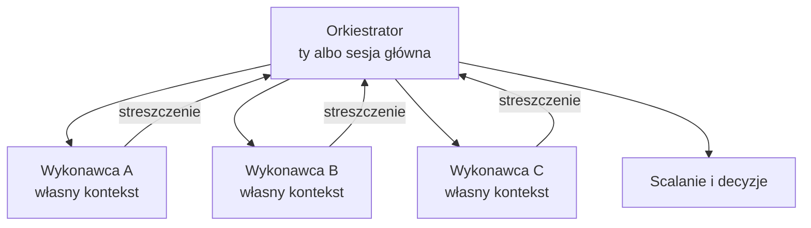

# Moduł 6 - Orkiestracja wieloagentowa

> Czego się tu nauczysz: dzielić pracę między równolegle działających agentów tak,
> żeby scalenie było tanie - i wiedzieć, kiedy przerwać agenta, który kręci się w kółko.

---

## 6.1. Kiedy równoległość ma sens, a kiedy jest kosztem

Uruchomienie trzech agentów nie daje trzykrotnego przyspieszenia. Daje trzykrotny koszt
tokenów i **jedno scalenie**, którego wcześniej nie było.

Równoległość opłaca się wtedy, gdy:

- zadania są **niezależne** - wynik jednego nie jest wejściem drugiego,
- każde wymaga **czytania** dużej ilości kodu (to jest ta część, która trwa),
- **konflikty da się przewidzieć** - wiesz z góry, gdzie się zetkną.

Nie opłaca się, gdy:

- zadania dotyczą tego samego pliku (scalenie zje zysk),
- jedno zadanie zależy od decyzji podjętej w drugim,
- całość jest krótsza niż narzut na przygotowanie środowisk.

> Reguła: **jeżeli nie potrafisz z góry powiedzieć, gdzie będzie konflikt,
> podział jest zły.** Wróć do kartki, zanim odpalisz agentów.

---

## 6.2. Orkiestrator i wykonawcy



| Rola | Odpowiada za | Nie odpowiada za |
|---|---|---|
| Orkiestrator | podział pracy, granice, scalanie, decyzje | pisanie kodu w zadaniach |
| Wykonawca | jedno zadanie, od początku do zielonej bramki | to, co robią pozostali |

**Podział musi być rozstrzygnięty przed startem.** Wykonawcy nie widzą się nawzajem
i nie mogą się dogadać w trakcie. Wszystko, czego potrzebują, musi być w zleceniu.

### Dwie formy równoległości

| | Subagenci w jednej sesji | Osobne sesje w worktree |
|---|---|---|
| Kontekst | osobny per subagent | osobny per sesja |
| Pliki | ten sam katalog (o ile nie ma izolacji) | osobne katalogi |
| Konflikty przy pisaniu | **realne** | nie ma - są dopiero przy scalaniu |
| Kto orkiestruje | sesja główna | ty |
| Widzisz przebieg | streszczenie na końcu | cały, w osobnym terminalu |

Trzecia forma to połączenie: subagent z `isolation: worktree` dostaje własny katalog,
a mimo to jest orkiestrowany przez sesję główną.

---

## 6.3. Subagenci: kontekst i wynik

Subagent startuje z **pustym, izolowanym oknem kontekstu**. Nie widzi twojej rozmowy.
Do sesji głównej wraca **streszczenie, nie transkrypt** - gadatliwe wyjście
(logi, wyniki grepa, treść plików) zostaje w jego kontekście.

To jest główny powód, dla którego subagenci istnieją: **oddzielenie pracy pochłaniającej
kontekst od rozmowy, która musi zostać czysta.**

### Definicja w repozytorium

```
.claude/agents/<nazwa>.md
```

```yaml
---
name: migrator
description: Kiedy sięgnąć po tego agenta i do czego on nie służy.
tools: Read, Edit, Write, Grep, Glob, Bash
model: sonnet
isolation: worktree
maxTurns: 25
---
```

Pola, które warto znać:

| Pole | Do czego |
|---|---|
| `tools` | zawężenie narzędzi; bez tego dziedziczy wszystkie |
| `model` | `haiku`/`sonnet`/`opus`/`fable`/pełne ID/`inherit` |
| `isolation: worktree` | własny, tymczasowy git worktree |
| `maxTurns` | **budżet tur** - twardy limit |
| `permissionMode` | tryb uprawnień dla tego agenta |
| `skills` | skille wczytane do kontekstu na starcie |
| `omitClaudeMd` | start bez plików `CLAUDE.md` |

Wybór modelu rozstrzyga się w kolejności: parametr per wywołanie → `model` z frontmattera
→ zmienna `CLAUDE_CODE_SUBAGENT_MODEL` → model sesji głównej.

Wymuszenie jednego modelu dla wszystkich subagentów:

```json
{ "env": { "CLAUDE_CODE_SUBAGENT_MODEL": "haiku", "CLAUDE_CODE_SUBAGENT_MODEL_FORCE": "1" } }
```

### Limity

- **20 subagentów** jednocześnie (`CLAUDE_CODE_MAX_CONCURRENT_SUBAGENTS`).
- **3 poziomy** zagnieżdżenia (`CLAUDE_CODE_MAX_SUBAGENT_SPAWN_DEPTH`).

Praktycznie nigdy nie zbliżysz się do dwudziestu. Trzy-cztery to sensowny sufit
dla człowieka, który ma potem przeczytać wyniki.

### Format wyniku - narzuć go

Subagent zwraca to, co uzna za stosowne, chyba że mu powiesz. Narzucenie formatu
zamienia trzy niepodobne raporty w trzy porównywalne:

```
ZAKRES: <co miało być zmienione>
ZMIENIONE: <liczba> wystąpień w <liczba> plikach
  - ścieżka:linia - opis zmiany
POMINIĘTE: <co wymaga decyzji, z uzasadnieniem>
BRAMKA: zielona | czerwona (+ pierwsze 5 linii błędu)
RYZYKA: <co może się zepsuć, czego nie sprawdziłem>
```

Plus **limit długości**. Bez niego dostajesz streszczenie, które jest transkryptem
w przebraniu - i cały zysk kontekstowy znika.

Sekcja `POMINIĘTE` jest najważniejsza. To jest miejsce, w którym subagent ma prawo
powiedzieć „tego nie ruszyłem, bo wymaga decyzji" - i jedyne, które chroni przed
cichym rozstrzygnięciem.

---

## 6.4. Git worktree

Worktree to **osobny katalog roboczy z własnym branchem**, dzielący historię i remote
z głównym checkoutem. Dwie sesje w dwóch worktree nie widzą nawzajem swoich plików.

### Wbudowana obsługa

```bash
claude --worktree feature-auth     # albo -w
```

Tworzy `.claude/worktrees/feature-auth/` na branchu `worktree-feature-auth` i startuje tam sesję.
Bez nazwy generuje własną.

```bash
claude --worktree "#1234"          # z pull requesta; cudzysłów, bo # to komentarz
```

**Dwie rzeczy do `.gitignore`, zanim ktokolwiek użyje worktree:**

```gitignore
.claude/worktrees/              # zawartość worktree w głównym checkoucie
.claude/settings.local.json     # ustawienia osobiste, m.in. worktree.baseRef
```

Bez pierwszego wiersza pliki z worktree pokażą się jako nieśledzone w głównym checkoucie.
Bez drugiego - czyjeś osobiste ustawienie `baseRef` trafi do repozytorium i zacznie
obowiązywać cały zespół.

| Ustawienie | Znaczenie |
|---|---|
| `worktree.baseRef: "fresh"` | branch z domyślnej gałęzi remote (domyślne) |
| `worktree.baseRef: "head"` | branch z bieżącego lokalnego `HEAD` |

Do izolacji subagenta: `isolation: worktree` we frontmatterze albo „pracuj w worktree"
powiedziane w rozmowie.

### Ręcznie

```bash
git worktree add ../projekt-a -b feature-a      # nowy branch
git worktree add ../projekt-b istniejacy-branch # istniejący
git worktree list
git worktree remove ../projekt-a                # --force przy niezacommitowanych zmianach
git worktree unlock <ścieżka>                   # gdy git odmawia usunięcia
```

### Środowisko per worktree

**Worktree to świeży checkout.** Nie ma w nim niczego, co jest w `.gitignore`:
`.venv/`, `.env`, lokalnych baz, plików konfiguracyjnych.

Pliki spoza gita kopiuje się automatycznie przez `.worktreeinclude` w katalogu głównym
(składnia jak `.gitignore`; kopiowane są tylko pliki pasujące do wzorca **i** gitignorowane):

```text
.env
.env.local
config/sekrety.json
```

Reszta środowiska wymaga decyzji:

| Zasób | Problem | Rozwiązanie |
|---|---|---|
| Zależności | brak `.venv` w nowym worktree | instalacja per worktree albo współdzielony interpreter |
| Baza testowa | dwa worktree, jedna baza = wyścig | baza per worktree albo plik SQLite w katalogu |
| Porty | dwa `uvicorn` na 8000 | port per worktree |
| Cache narzędzi | zwykle bezpieczny do współdzielenia | zostawić |

W repozytorium kursu jest to proste: baza to plik SQLite w katalogu worktree,
a `python seed.py` odtwarza ją od zera.

### Co worktree dzieli z głównym checkoutem

Katalog `.git`, pluginy zainstalowane w zakresie projektu i **zapisane zgody permission**
(lądują w `.claude/settings.local.json` głównego checkoutu).

### Cztery kontrole izolacji

Gdy sesja jest w worktree, Claude Code blokuje:

1. edycję pliku w głównym checkoucie,
2. komendę, której katalog roboczy wskazuje na główny checkout,
3. przekierowanie gita do głównego checkoutu (`git -C`, `--git-dir`, `GIT_DIR`, `cd`),
4. komendę, której kształtu nie da się zweryfikować (nazwa liczona w runtime,
   nieparsowalna składnia) - **tej kontroli nie da się wyłączyć.**

### Pułapka: ścieżki hooków nie idą za worktree

`${CLAUDE_PROJECT_DIR}` wskazuje katalog, w którym **wystartowała sesja**, i nie zmienia się
po wejściu w worktree. Ścieżka worktree przychodzi do hooka w polu **`cwd`** na stdin.

Konsekwencja praktyczna: bramka jakości uruchamiana przez `${CLAUDE_PROJECT_DIR}`
testowałaby **główny checkout** zamiast worktree, w którym trwa praca - i świeciłaby
na zielono dla kodu, którego nikt nie zmienił. Dlatego hook z modułu 5 czyta `cwd`.

### Sprzątanie

Przy wyjściu z sesji interaktywnej Claude sprawdza, czy w worktree jest praca
(zmienione albo nieśledzone pliki, nowe commity) i pyta. Sesje `-p` nie sprzątają.

Worktree subagentów bez zmian są usuwane automatycznie; ze zmianami zostają do okresowego
przeglądu (`cleanupPeriodDays`). W trakcie pracy agenta Claude Code trzyma na worktree
`git worktree lock`.

---

## 6.5. Dzielenie zadania na niezależne fragmenty

Cztery osie podziału, od najbezpieczniejszej:

| Oś | Przykład | Ryzyko konfliktu |
|---|---|---|
| **Po plikach** | A dotyka `rabaty.py`, B `raporty.py` | bardzo niskie |
| **Po warstwach** | A testy, B dokumentacja, C kod | niskie |
| **Po funkcjach** | trzy niezależne endpointy | średnie |
| **Po etapach** | A pisze, B recenzuje | **sekwencyjne, nie równoległe** |

Ostatni wiersz to najczęstszy błąd: recenzent nie może pracować równolegle z autorem,
bo recenzuje kod, który jeszcze się zmienia.

### Zaplanuj konflikt, zamiast go unikać

Przy realnym podziale konflikt i tak wystąpi. Lepiej **wiedzieć gdzie**, niż udawać,
że go nie będzie:

- wypisz z góry pliki, których dotknie każde zadanie,
- część wspólną **zaznacz w zleceniu obu wykonawców**,
- scalaj w ustalonej kolejności, zaczynając od zadania o najmniejszym zasięgu.

Konflikt w jednej linii, o którym wiedziałeś, kosztuje minutę. Konflikt w dwustu liniach,
o którym nie wiedziałeś, kosztuje wieczór.

---

## 6.6. Budżety i przerywanie

Agent kręcący się w kółko to nie awaria - to normalny stan, gdy zadanie jest źle postawione
albo napotkał przeszkodę, której nie umie nazwać.

### Objawy

| Objaw | Co to znaczy |
|---|---|
| Ta sama komenda trzeci raz z drobną zmianą | nie rozumie błędu |
| „Spróbuję innego podejścia" po raz trzeci | brakuje mu informacji, której nie ma w repo |
| Czytanie kolejnych plików bez zmian w kodzie | szuka czegoś, czego nie ma |
| Rosnące, coraz bardziej ogólne komunikaty | stracił kontakt z zadaniem |
| Modyfikacja testu, żeby przeszedł | zadanie jest niewykonalne tak, jak je postawiłeś |

**Ostatni jest najgroźniejszy**, bo wygląda na sukces.

### Twarde limity

| Mechanizm | Gdzie |
|---|---|
| `maxTurns` | frontmatter subagenta |
| `--max-budget-usd` | flaga CLI, **tylko w trybie `-p`** (print mode) |
| `timeout` | pole hooka |
| `Esc` | ty, natychmiast |

`maxTurns` na subagencie jest najważniejszy, bo subagenta **nie widzisz w trakcie**.
Sesję główną przerwiesz `Esc`. Subagent bez limitu tur może zużyć budżet
i wrócić ze streszczeniem, którego nie da się użyć.

### Co robić po przerwaniu

Nie „spróbuj jeszcze raz". To samo zlecenie da ten sam wynik.

1. Przeczytaj, na czym utknął.
2. Zdecyduj: brakuje informacji, czy zadanie jest źle postawione?
3. Brakuje informacji → dopisz ją do zlecenia albo do `CLAUDE.md`.
4. Źle postawione → podziel na mniejsze albo rozstrzygnij sam to, czego agent nie może.

---

## Do zapamiętania

1. Trzech agentów to trzykrotny koszt i jedno scalenie. Musi się opłacić.
2. Jeśli nie umiesz wskazać, gdzie będzie konflikt - podział jest zły.
3. Subagent ma **własny, pusty kontekst** i zwraca **streszczenie**. To jest jego sens.
4. Narzuć format wyniku i limit długości, z obowiązkową sekcją „pominięte".
5. Worktree to świeży checkout: nie ma `.venv`, `.env` ani baz. `.worktreeinclude`
   kopiuje pliki spoza gita.
6. `${CLAUDE_PROJECT_DIR}` zostaje w katalogu startu; ścieżka worktree jest w polu `cwd`.
7. Podział po plikach jest najbezpieczniejszy. Podział „autor i recenzent" nie jest
   równoległy.
8. `maxTurns` na subagencie jest ważniejszy niż na sesji głównej, bo subagenta
   nie widać w trakcie.

Następny krok: [lab 6.1](lab-6-1.md), potem [lab 6.2](lab-6-2.md). · [Ściąga](sciaga.md)
