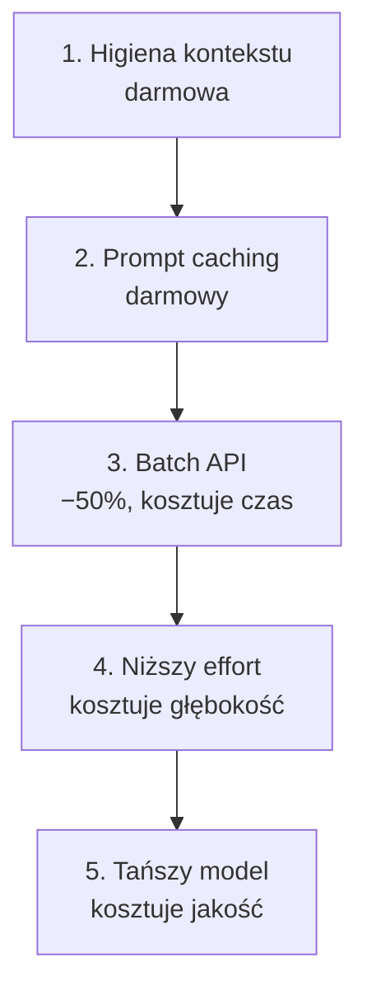
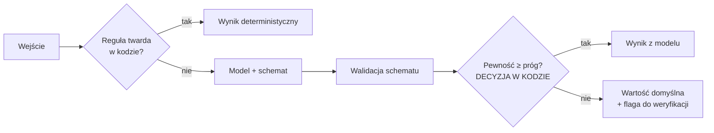

# Moduł 7 - Ekonomia i determinizm

> Zakres modułu: obniżanie kosztu pracy z agentem w kolejności od darmowych wygranych
> do kompromisów - i budowa produktu, w którym model jest częścią systemu, a nie jego sercem.

---

## Lekcja 7.1 - Kolejność, w której obniża się koszty

Najczęstszy błąd: pierwszym ruchem jest zmiana modelu na tańszy. To jest **ostatni** ruch,
bo jako jedyny kosztuje jakość.



| Dźwignia | Koszt wdrożenia | Strata |
|---|---|---|
| `/clear` między zadaniami | zero | nic |
| celowane czytanie zamiast hurtowego | zero | nic |
| prompt caching | jednorazowe ułożenie promptu | nic |
| Batch API | przepisanie zadania na nieinteraktywne | natychmiastowość |
| niższy `effort` | zmiana ustawienia | głębokość rozumowania |
| tańszy model | zmiana ustawienia | jakość **i cache** |

Ostatni wiersz ma dopisek, o którym łatwo zapomnieć: **cache jest przypisany do modelu.**
Przeskakiwanie między modelami w jednej sesji oznacza budowanie cache'u od nowa za każdym razem.

---

## Lekcja 7.2 - Routing modeli do roli

Model dobiera się do **roli w procesie**, nie do „trudności zadania".

| Rola | Model | Effort | Dlaczego |
|---|---|---|---|
| Planista, decyzje architektoniczne | Opus | `high`-`max` | błąd kosztuje dni pracy |
| Wykonawca wg specyfikacji | Sonnet | `medium`-`high` | kształt jest ustalony |
| Zbieracz faktów, subagent | Haiku | - | wynik to lista, nie rozumowanie; **Haiku nie obsługuje effortu** |
| Przekształcenia mechaniczne | Haiku (bez effortu) / Sonnet | `low` | liczy się konsekwencja |
| Przegląd bezpieczeństwa | Opus | `high`-`max` | fałszywy negatyw jest droższy niż model |

W praktyce: `/model` i `/effort` w sesji, `model:` we frontmatterze subagenta,
`CLAUDE_CODE_SUBAGENT_MODEL` jako domyślny model subagentów - frontmatter `model:` ma nad
tą zmienną pierwszeństwo. Objęcie naprawdę wszystkich, także wbudowanych Explore i Plan,
wymaga dołożenia `CLAUDE_CODE_SUBAGENT_MODEL_FORCE=1`.

### Przed budową kaskady modeli

Kuszący pomysł: tani model robi pierwsze podejście, drogi poprawia. Przed budową trzeba
**zmierzyć prostszy wariant**: mocniejszy model na niższym efforcie.

Nowsze modele na niskim efforcie często wypadają lepiej niż starsze na wysokim - a kaskada
kosztuje osobno: dwa modele to dwa cache'e i dwa razy więcej kodu do utrzymania.

Mierzy się **koszt na ukończone zadanie**, nie na zapytanie. Tańsze zapytanie, które wymaga
trzech kolejnych tur, nie jest tańsze.

### Alternatywne endpointy

Ten sam model bywa dostępny u różnych dostawców - Anthropic API, Bedrock, Vertex, Foundry.
Różnice, które mają znaczenie: cennik (partnerzy mają własny), dostępność funkcji,
identyfikatory modeli, i to, gdzie fizycznie trafiają dane.

Ostatni punkt zwykle rozstrzyga decyzję i należy do modułu 8, nie do tego.

---

## Lekcja 7.3 - Prompt caching

Caching działa na **prefiksie**. Zmiana jednego bajtu gdziekolwiek w prefiksie unieważnia
wszystko po niej.

**Kolejność renderowania: `tools` → `system` → `messages`.**

```
┌─────────────────────────────────────────┐
│ tools       - stabilne                  │
│ system      - stabilne  ← cache tutaj   │
├─────────────────────────────────────────┤
│ messages    - zmienne                   │
└─────────────────────────────────────────┘
```

Reguła układania: **stabilne na początek, zmienne po ostatnim punkcie cache'owania.**

```python
system=[{
    "type": "text",
    "text": PROMPT_SYSTEMOWY,                  # stały prefiks
    "cache_control": {"type": "ephemeral"},    # punkt cache'owania
}],
messages=[{"role": "user", "content": f"Opis pozycji: {opis}"}],   # zmienna część
```

### Cisi zabójcy cache'u

| Co | Dlaczego psuje |
|---|---|
| `datetime.now()` w prompcie systemowym | każdy request ma inny prefiks |
| identyfikator żądania w nagłówku systemowym | to samo |
| nieposortowany JSON w kontekście | kolejność kluczy zmienia bajty |
| lista narzędzi budowana dynamicznie | `tools` idzie **przed** `system` |
| zmiana modelu | cache jest per model |

### Weryfikacja

**`usage.cache_read_input_tokens`.** Zero przy powtarzanych żądaniach oznacza cichy
invalidator. Nie ma innego sposobu, żeby to zauważyć: wszystko działa, tylko drożej.

W Claude Code to samo widać w `/usage`, w linii statystyk prompt cache:

```
Prompt cache (main): 14 requests · 91% of input tokens from cache · 2 misses
                     (last 6m 10s ago, 310.2k tokens re-cached) · warm (1h TTL)
```

**Czas życia cache'u - domyślnie godzina na subskrypcji, pięć minut na kluczu API.**
To jest różnica, która zmienia sposób pracy: na subskrypcji przerwa na kawę nie kosztuje,
na kluczu API domyślnie kosztuje przeliczenie całego kontekstu.

**To domyślka, nie limit platformy.** Godzinę na kluczu API włącza się jawnie:
ustawieniem `promptCacheTtl: "1h"` (v2.1.242+) albo `ENABLE_PROMPT_CACHING_1H=1`.
W API bezpośrednio: `cache_control: {"type": "ephemeral", "ttl": "1h"}`.
Sprawdzenie, który TTL faktycznie poszedł: `claude -p "hello" --output-format json`
i pole `usage.cache_creation` - zapisy godzinne raportowane są jako
`ephemeral_1h_input_tokens`.

Limity: maksymalnie **4 punkty cache'owania** na żądanie, minimalny prefiks 512-4096 tokenów
zależnie od modelu (krótszy po cichu się nie zacache'uje).

---

## Lekcja 7.4 - Kontrola rozrostu kontekstu

Trzy mechanizmy, w kolejności od najtańszego.

**`/clear` między zadaniami.** Kosztuje zero i działa natychmiast. Jedna sesja = jedno zadanie.
`/rename` przed wyczyszczeniem, gdy sesja ma być jeszcze dostępna przez `/resume`.

**Ograniczanie czytania.** Pomiar z labu 2.1: „przeczytaj katalog" kontra
„znajdź, gdzie liczony jest X" to różnica dwudziestokrotna przy tej samej odpowiedzi.
Agentowi podaje się, **co ma ustalić**, nie **jak ma czytać**.

**Kompakcja.** `/compact` streszcza starszą historię. Można nią sterować:

```
/compact Skup się na kodzie i wynikach testów, pomiń ślepe uliczki.
```

Instrukcje kompakcji można też wpisać na stałe do `CLAUDE.md`:

```markdown
# Compact instructions
Przy kompaktowaniu zachowaj wyniki testów i wprowadzone zmiany w kodzie.
```

**Co przeżywa kompakcję:** projektowy `CLAUDE.md` z korzenia jest czytany ponownie z dysku.
Instrukcja podana tylko w rozmowie - przepada.

**`/compact` kontra `/clear`:** kompakcja czyta całą historię, żeby ją streścić,
więc sama jest dużym żądaniem. Gdy ciągłość nie jest potrzebna, `/clear` nie kosztuje nic.

### Skondensowane wyniki narzędzi

Hook `PreToolUse` może **przerobić komendę, zanim się wykona**. Zamiast 10 000 linii logu
w kontekście - same błędy:

```json
{
  "hookSpecificOutput": {
    "hookEventName": "PreToolUse",
    "permissionDecision": "allow",
    "updatedInput": { "command": "pytest -q > /tmp/pytest.log 2>&1; k=$?; grep -E \"FAIL|ERROR\" /tmp/pytest.log | head -50; exit $k" }
  }
}
```

**`updatedInput` podmienia CAŁE wejście narzędzia**, nie scala się z nim - w jq buduje się je
przez `(.tool_input + {command: $filtered})`, żeby nie zgubić pozostałych pól.

> **Filtr nie może zjeść kodu wyjścia.** Naiwne `pytest | grep | head` zwraca kod
> **ostatniej** komendy potoku, czyli `head` - a `head` kończy się sukcesem zawsze.
> Nieudane testy wyglądałyby wtedy jak udane. Dlatego kod `pytest` jest zapamiętywany
> w `k` i zwracany na końcu, a pełny raport zostaje w pliku, gdy trzeba go obejrzeć.

To jest najbardziej niedoceniana dźwignia z całego modułu: przenosi filtrowanie
z kontekstu modelu do powłoki, gdzie jest darmowe.

Inne miejsca, w których to samo działa: subagent zwracający streszczenie zamiast transkryptu
(moduł 6), skille zamiast rozdętego `CLAUDE.md` (moduł 2), CLI zamiast serwera MCP.

---

## Lekcja 7.5 - Batch API

**Połowa ceny**, asynchronicznie. Zwykle do godziny, maksymalnie 24 h.

Nadaje się do: przeklasyfikowania archiwum, masowej ekstrakcji, generowania opisów,
oceny golden setu, wszystkiego, na co nikt nie czeka.

Nie nadaje się do niczego interaktywnego.

```python
paczka = klient.messages.batches.create(requests=[
    Request(custom_id="pozycja-0", params=MessageCreateParamsNonStreaming(...)),
])

while klient.messages.batches.retrieve(paczka.id).processing_status != "ended":
    time.sleep(30)

for wynik in klient.messages.batches.results(paczka.id):
    ...
```

> **Wyniki wracają w dowolnej kolejności.** Kluczowanie po `custom_id`, nigdy po pozycji na liście.
> To jest błąd, który przechodzi testy na paczce trzyelementowej i psuje dane na tysiącu.

Batch API działa na kluczu API, nie na subskrypcji Pro/Max. Gotowy skrypt jest
w `skrypty/batch_klasyfikacja.py` - do uruchomienia u siebie w firmie.

---

## Lekcja 7.6 - Pomiar

Bez pomiaru rozmowa o kosztach jest rozmową o wrażeniach.

### Na subskrypcji Pro/Max

`/usage` pokazuje:

- **paski limitu planu** - to jest realny budżet,
- **atrybucję zużycia** - ile zużycia przypada na skille, subagentów, pluginy,
  poszczególne serwery MCP,
- **flagi zachowań** - gdy coś odpowiada za ponad 10% zużycia (długi kontekst, chybienia cache),
- przełącznik `d`/`w` - ostatnie 24 h albo 7 dni.

Blok `Session` pokazuje też kwotę w dolarach, ale **na subskrypcji ta liczba nie ma
związku z rachunkiem** - jest liczona lokalnie po cenniku katalogowym. Istotne są
paski i atrybucja.

`/context` pokazuje, co **teraz** zajmuje okno. `/insights` generuje raport HTML
o sposobie pracy z ostatnich sesji.

### Na kluczu API

Tam są prawdziwe liczby: `usage.input_tokens`, `usage.output_tokens`,
`usage.cache_creation_input_tokens` i `usage.cache_read_input_tokens` w każdej odpowiedzi.

**Każda kategoria wejścia ma inną cenę**, więc pomnożenie sumy przez jedną stawkę daje
zły wynik: zwykłe wejście po pełnej, zapis do cache'u 1,25 raza drożej przy TTL 5 minut
i 2 razy przy TTL 1 godziny, odczyt po jednej dziesiątej. Rozbicie zapisu po TTL jest
w `usage.cache_creation`.

Gotowy skrypt: `skrypty/pomiar_kosztu.py` - uruchamia to samo zadanie w trzech rolach
i wypisuje tabelę. Koszt jest **zmierzony** z pola `usage` każdej odpowiedzi, a nie
oszacowany z długości tekstu. Rola zbieracza faktów jedzie na Haiku **bez pola `effort`**,
bo ten model go nie obsługuje - podanie go byłoby błędem kontraktu, nawet gdyby API
przyjęło żądanie.

### Co mierzyć

| Metryka | Po co |
|---|---|
| Koszt **na ukończone zadanie** | jedyna, która ma sens biznesowy |
| Udział tokenów z cache | czy prompt jest dobrze ułożony |
| Zużycie per rola | gdzie routing się nie opłaca |
| Liczba tur do ukończenia | czy zadania są dobrze postawione |

Punkty odniesienia z dokumentacji, do kalibracji oczekiwań:
około **13 USD na dewelopera na dzień aktywny**, **150-250 USD miesięcznie**
we wdrożeniach korporacyjnych.

---

## Lekcja 7.7 - Determinizm w produkcie

Do tej pory model był narzędziem programisty. Teraz jest **częścią systemu**,
który działa bez autora. Obowiązują inne zasady.

### Zasada: decyzje w kodzie, nie w modelu



Trzy warstwy, w tej kolejności:

1. **Reguła twarda w kodzie.** To, co da się rozstrzygnąć deterministycznie, rozstrzygamy
   bez modelu. Taniej, szybciej, powtarzalnie - i testowalnie zwykłym testem jednostkowym.
2. **Model ze schematem.** Dopiero to, czego reguła nie objęła. Odpowiedź jest **walidowana
   względem schematu**, a nie parsowana ręcznie.
3. **Decyzja progowa w kodzie.** Model zwraca wynik **i pewność**. To, czy tej pewności
   wystarczy, rozstrzyga kod.

Punkt trzeci jest najważniejszy i najczęściej pomijany. Model, który sam decyduje,
czy jest wystarczająco pewny, jest modelem bez nadzoru.

### Structured outputs

```python
class KlasyfikacjaVAT(BaseModel):
    stawka: Literal["23", "8", "5", "0", "zw"]
    pewnosc: float = Field(ge=0.0, le=1.0)
    uzasadnienie: str = Field(min_length=1, max_length=300)

odpowiedz = klient.messages.parse(
    model="claude-haiku-4-5",
    max_tokens=512,
    messages=[...],
    output_format=KlasyfikacjaVAT,
)
wynik = odpowiedz.parsed_output      # zwalidowana instancja
```

Dla surowego schematu: `output_config={"format": {"type": "json_schema", "schema": {...}}}`
na `messages.create()`. Parametr `output_format` na `create()` jest **przestarzały**.

Dla narzędzi: `strict: true` **na definicji narzędzia** (nie na `tool_choice`), a schemat
musi mieć `additionalProperties: false` i `required`.

### Walidacja poza schematem

Schemat gwarantuje **kształt**, nie **sens**. Zawsze zostaje warstwa, której schemat nie obejmie:

- stawka składniowo poprawna, ale nieobsługiwana przez system,
- data w przyszłości tam, gdzie powinna być przeszła,
- kwota mieszcząca się w typie, ale absurdalna.

Te sprawdzenia należą do kodu. **Schemat ich nie złapie.**

### Golden set: co testuje, a czego nie

Prompt jest kodem. Zmiana promptu jest zmianą zachowania systemu - i tak samo wymaga testu.
Tylko że test musi wtedy **wywołać model**, a to kosztuje i nie jest deterministyczne.

Stąd podział na dwie rzeczy, które łatwo pomylić:

| | Co uruchamia | Co wykrywa | Kiedy |
|---|---|---|---|
| **Testy offline** (golden set z zapisanymi odpowiedziami) | kod klasyfikatora, na gotowych odpowiedziach | regresje w regułach twardych, progu, routingu i obsłudze odpowiedzi | każdy commit, w CI |
| **Ewaluacja promptu** | prawdziwy model na oznaczonym zbiorze | regresje promptu i zmiany modelu | przy zmianie promptu albo modelu |

> **Testy offline nie wykryją regresji promptu.** Odpowiedzi pochodzą z pliku, więc
> podmiana `PROMPT_SYSTEMOWY` na cokolwiek zostawi je zielone. To nie jest wada tych
> testów - to ich zakres. Wadą jest nazwanie ich testem promptu i spanie spokojnie.

Golden set to zbiór przypadków z oczekiwanymi wynikami, uruchamiany w CI:

```
{"opis": "Hosting miesieczny", "oczekiwana": "23", "zrodlo": "model", "odpowiedz": {...}}
```

Trzy rzeczy, które robią golden set użytecznym:

1. **Sprawdza źródło decyzji, nie tylko wynik.** Nie wystarczy trafić stawkę -
   liczy się, czy ustaliła ją reguła, model, czy fallback. Prompt, który przypadkiem
   trafia dobrze, to nie to samo co reguła, która trafia zawsze.
2. **Działa offline.** Odpowiedzi modelu są w golden secie, testy chodzą na mocku.
   CI nie płaci za tokeny i nie zależy od sieci.
3. **Zmiana wyniku jest świadoma.** Gdy test kończy się błędem po zmianie kodu - reguły
   twardej, progu, routingu - albo po odświeżeniu zapisanych odpowiedzi, golden set
   aktualizuje się **razem z uzasadnieniem w commicie**. To jest różnica między zmianą
   a dryfem.

---

## Do zapamiętania

1. Kolejność obniżania kosztów: higiena kontekstu → caching → Batch → effort → model.
   Zmiana modelu jest ostatnia, bo jako jedyna kosztuje jakość.
2. Cache jest **per model**. Kaskada modeli to kaskada cache'y.
3. Kolejność renderowania: `tools` → `system` → `messages`. Stabilne na początek.
4. `usage.cache_read_input_tokens` równe zero przy powtórzeniach = cichy invalidator.
5. TTL cache'u: godzina na subskrypcji, pięć minut na kluczu API.
6. Hook `PreToolUse` może odfiltrować wyjście komendy, zanim wejdzie do kontekstu.
7. Batch API: połowa ceny, wyniki **w dowolnej kolejności**, kluczowanie po `custom_id`.
8. Na Pro/Max pomiar idzie paskami limitu i atrybucją, nie kwotą z bloku `Session`.
9. W produkcie: reguła w kodzie → model ze schematem → **decyzja progowa w kodzie**.
10. Schemat gwarantuje kształt, nie sens. Testy offline sprawdzają kod klasyfikatora;
    regresję promptu wykrywa dopiero ewaluacja wołająca model.

Następny krok: [lab 7.1](lab-7-1.md), potem [lab 7.2](lab-7-2.md). · [Ściąga](sciaga.md)
